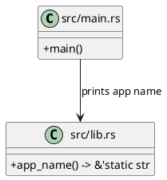
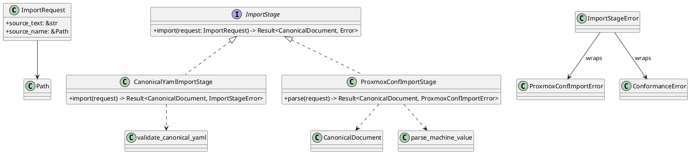
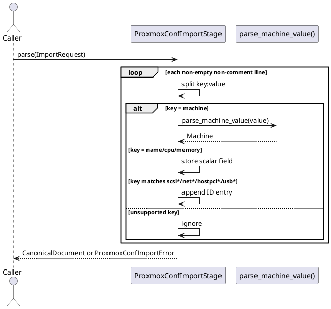
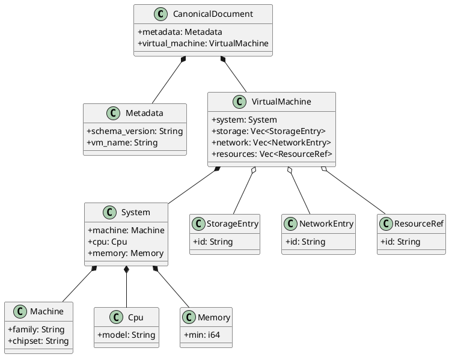
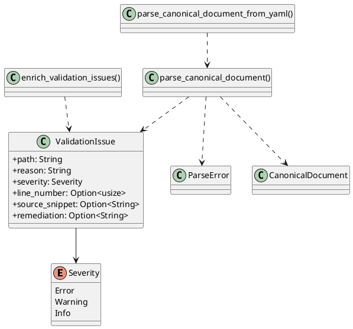
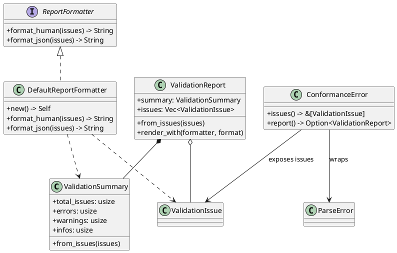
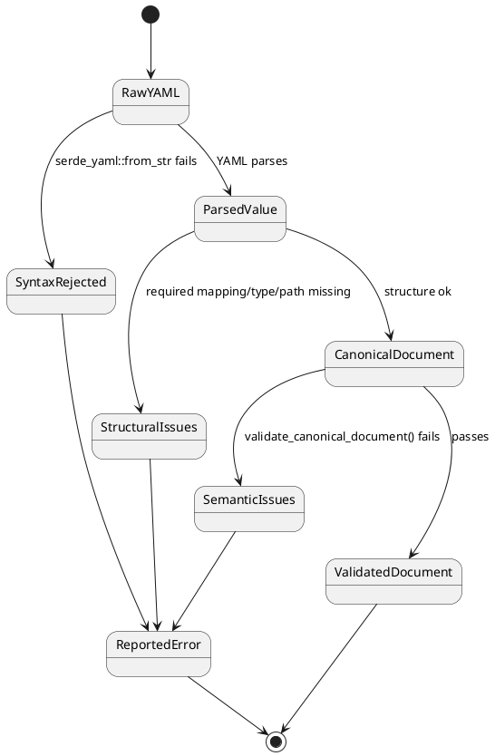
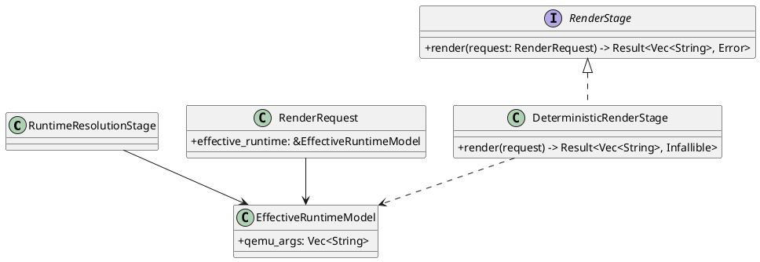
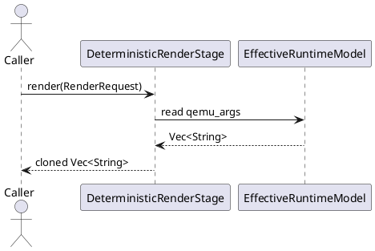

# Current Implementation Architecture

This page is a snapshot of the implementation as it exists now. I kept it under `doc/dev/architecture/` because it documents the live module boundaries and stage flow rather than a future design target.

## Overview

`src/main.rs` is currently a thin entrypoint that prints the crate app name from `src/lib.rs`. The library root exposes four implementation areas:

- `src/import_stage/` for source adapters and import orchestration
- `src/vm_spec/` for the canonical VM schema, parsing, validation, and reporting
- `src/runtime_resolution/` for the runtime-host boundary scaffold
- `src/render_stage/` for deterministic QEMU argument rendering

The current data flow matches the model-separation pipeline described in the other architecture notes:

1. Import source text becomes a canonical `CanonicalDocument`
2. Canonical data is validated against structural and semantic rules
3. Runtime resolution is represented by a placeholder runtime model
4. Deterministic render returns an ordered QEMU argument vector

## Module Map

| Module | Current responsibility | Key types / functions |
| --- | --- | --- |
| `src/lib.rs` | Crate wiring | `app_name()` |
| `src/main.rs` | CLI entrypoint | `main()` |
| `src/import_stage/mod.rs` | Import stage boundary | `ImportRequest`, `ImportStage`, `ImportStageError` |
| `src/import_stage/canonical_yaml.rs` | Canonical YAML adapter | `CanonicalYamlImportStage` |
| `src/import_stage/proxmox_conf.rs` | Proxmox `.conf` adapter | `ProxmoxConfImportStage`, `ProxmoxConfImportError`, `parse_machine_value()` |
| `src/vm_spec/mod.rs` | Canonical schema exports | `CanonicalDocument`, `ParseError`, `ValidationIssue`, `ConformanceError`, `validate_canonical_yaml()`, `validate_canonical_document()` |
| `src/vm_spec/model.rs` | Canonical data model | `Metadata`, `VirtualMachine`, `System`, `Machine`, `Cpu`, `Memory`, `StorageEntry`, `NetworkEntry`, `ResourceRef` |
| `src/vm_spec/parsing.rs` | YAML parsing and structural validation | `Severity`, `ValidationIssue`, `ParseError`, `parse_canonical_document_from_yaml()`, `parse_canonical_document()`, `enrich_validation_issues()` |
| `src/vm_spec/validation.rs` | Semantic validation and report formatting | `ValidationSummary`, `ValidationReport`, `ReportFormatter`, `DefaultReportFormatter`, `ConformanceError` |
| `src/runtime_resolution/mod.rs` | Runtime boundary scaffold | `RuntimeResolutionStage`, `EffectiveRuntimeModel` |
| `src/render_stage/mod.rs` | Render stage boundary | `RenderRequest`, `RenderStage` |
| `src/render_stage/deterministic.rs` | Deterministic renderer | `DeterministicRenderStage` |

## Entry Point And Wiring

The binary does not yet orchestrate the pipeline. It only calls `ezkvm::app_name()` and prints the result.

## Import Stage

The import stage owns source-adapter orchestration. It is intentionally narrow: a caller supplies source text plus the source name, and an adapter returns a canonical `CanonicalDocument` or a stage-specific error.

`CanonicalYamlImportStage` forwards directly to `validate_canonical_yaml()`. `ProxmoxConfImportStage` parses a subset of Proxmox `.conf` syntax and maps selected keys into canonical model fields. The stage trait is object-safe and uses an associated `Error` type.

The Proxmox adapter currently recognizes these source keys:

- `name` -> canonical VM name
- `machine` -> machine family/chipset
- `cpu` -> CPU model
- `memory` -> memory minimum
- `scsi*`, `net*`, `hostpci*`, `usb*` -> canonical ID lists

It rejects malformed lines, unsupported machine values, missing required fields, and invalid memory values. It does not attempt broad Proxmox coverage yet.

### Proxmox Import Flow

The Proxmox adapter is easier to understand as a short sequence: the source is scanned line by line, accepted fields are accumulated, and the final canonical document is assembled from the collected values.

## Canonical VM Specification

`src/vm_spec/model.rs` defines the canonical document tree. The model is deliberately simple and string-oriented so source adapters can normalize their inputs before runtime resolution or rendering.

`CANONICAL_SCHEMA_VERSION` is currently `1.0.0`. The schema expects `metadata` and `virtual_machine` at the top level, and `storage`, `network`, and `resources` are optional lists with default empty vectors.

## Parsing And Semantic Validation

The parser in `src/vm_spec/parsing.rs` is responsible for turning YAML into the canonical model while collecting structural issues in one pass. It defines the shared issue representation used by both parser and validator:

- `Severity` with `Error`, `Warning`, and `Info`
- `ValidationIssue` with path, reason, severity, and optional context
- `ParseError` with YAML-syntax and validation-issue variants

The parser accepts YAML text, converts it to `serde_yaml::Value`, validates required mappings and scalar types, parses repeated ID scopes, and enriches issues with line/snippet context when possible.

The semantic validation layer in `src/vm_spec/validation.rs` runs after parsing and enforces rules that require the canonical document as a whole:

- `metadata.vm_name` must match the filename stem when one is available
- `virtual_machine.system.machine.family` and `chipset` must be consistent
- IDs must be unique within each scope (`storage`, `network`, `resources`)
- required string fields must not be blank
- memory minimum must be non-negative

`validate_canonical_yaml()` is the high-level entry point for YAML input. It parses first, then validates, and enriches any validation issues with source context before returning a `ConformanceError`.

### Validation Flow

The validation path has two distinct failure states: syntax/structure failures from parsing, and semantic failures from document validation. Both carry the same issue shape once issues exist.

`DefaultReportFormatter` currently emits human-readable grouped text or a pretty-printed JSON report. The parser/validator populate `line_number` and `source_snippet` when the path can be resolved back into the source text, but those fields are still best-effort rather than source-exact.

## Runtime Resolution And Rendering

`src/runtime_resolution/mod.rs` currently contains a scaffold only: `RuntimeResolutionStage` and `EffectiveRuntimeModel`. The effective model holds a `qemu_args: Vec<String>` payload, and no runtime-resolution methods are implemented yet.

`src/render_stage/mod.rs` defines the render-stage boundary, and `src/render_stage/deterministic.rs` provides the current implementation. The deterministic renderer is intentionally simple: it returns a clone of the `EffectiveRuntimeModel.qemu_args` vector.

### Render Flow

The render stage is currently a pure pass-through from the effective runtime model to the command vector.

## Current Constraints

- The binary does not yet invoke import, validation, runtime resolution, or rendering.
- The runtime-resolution module is a placeholder boundary, not a working resolver.
- The Proxmox adapter covers a small, deterministic subset of `.conf` keys only.
- The canonical YAML path is the only path that currently runs full parse-plus-validation behavior in one call.

## Notes For Future Changes

Keep new source adapters in `src/import_stage/`, canonical schema changes in `src/vm_spec/`, runtime-host logic in `src/runtime_resolution/`, and deterministic argument shaping in `src/render_stage/`. That keeps the current module split aligned with the existing architecture notes and makes the validation boundary easier to preserve.