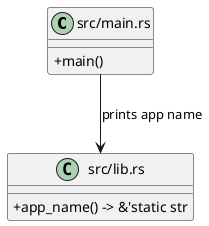

# Entrypoint And Wiring

Back to index: [Current Implementation Architecture](./current-implementation-architecture.md)

## Scope

This note covers crate entry wiring in:

- `src/main.rs`
- `src/lib.rs`

`src/main.rs` currently prints the crate app name from `ezkvm::app_name()` and does not orchestrate import, validation, runtime resolution, or render-stage execution.

## Current Wiring

## Notes

- Entrypoint behavior is intentionally minimal while module boundaries are being stabilized.
- Pipeline contracts are defined separately in [Model Separation Pipeline Contract](../model-separation-pipeline.md).
