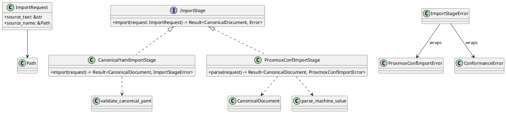
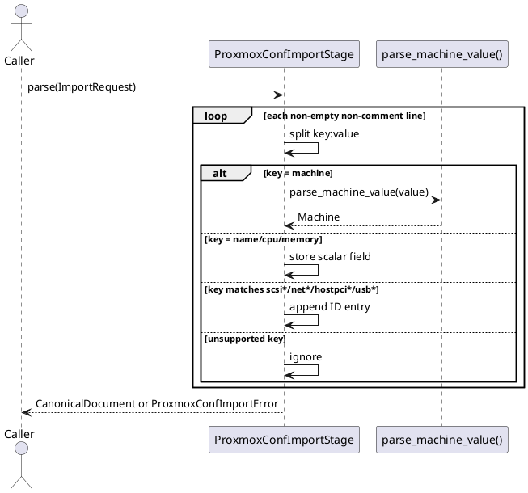

# Import Stage

Back to index: [Current Implementation Architecture](./current-implementation-architecture.md)

## Scope

This note covers source import adapters in:

- `src/import_stage/mod.rs`
- `src/import_stage/canonical_yaml.rs`
- `src/import_stage/proxmox_conf.rs`

The import stage takes source text plus source name and returns a canonical `CanonicalDocument` or a typed adapter error.

## Stage Structure

## Current Adapter Coverage

`CanonicalYamlImportStage` delegates to `validate_canonical_yaml()`.

`ProxmoxConfImportStage` currently maps these keys:

- `name` -> canonical VM name
- `machine` -> machine family and chipset
- `cpu` -> CPU model
- `memory` -> memory minimum
- `scsi*`, `net*`, `hostpci*`, `usb*` -> canonical ID lists

Malformed lines, unsupported machine values, missing required fields, and invalid memory values are rejected.

## Proxmox Parse Flow

## Related Docs

- [Import Adapters Contract](../import-adapters.md)
- [VM Spec, Parsing, And Validation](./vm-spec-parsing-validation.md)
