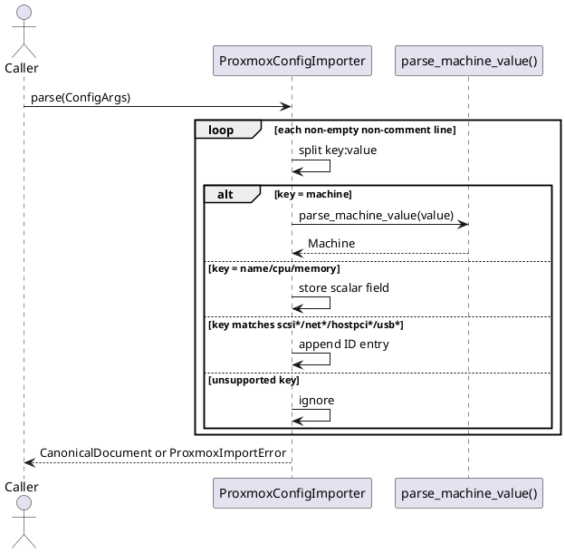

# Config Importer Stage (OUTDATED - See RuntimeBuilder)

⚠️ **THIS DOCUMENT DESCRIBES LEGACY ARCHITECTURE** — The import pattern described here has been replaced with the **RuntimeBuilder/SchemaBuilder stage pattern**. See [ezkvm README](../../src/config_format/ezkvm/README.md) for current implementation.

Back to index: [Current Implementation Architecture](./current-implementation-architecture.md)

## Scope

This note describes the **legacy** import adapters in:

- `src/config_importer/mod.rs` (legacy)
- `src/config_importer/ezkvm/mod.rs` (legacy)
- `src/config_importer/proxmox/mod.rs` (legacy)

The legacy config importer stage took importer-specific configuration and returned a canonical `CanonicalDocument`. **This pattern is superseded by RuntimeBuilder.**

## Stage Structure

```plantuml
@startuml
skinparam classAttributeIconSize 0

class ConfigArgs << (S,#98FB98) >> {
  +payload: Vec<u8>
  +source_hint: Option<PathBuf>
  +args: Vec<String>
}

interface ConfigImporter << (T,#FFB347) >> {
  +import_config(config_args: ConfigArgs) -> Result<CanonicalDocument, ConfigError>
}

class ConfigImportError << (S,#98FB98) >> {
}

class EzkvmConfigImporter << (S,#98FB98) >> {
  +import_config(config_args) -> Result<CanonicalDocument, ConfigImportError>
}

class ProxmoxConfigImporter << (S,#98FB98) >> {
  +parse(config_args) -> Result<CanonicalDocument, ProxmoxImportError>
}

class QemuConfigImporter << (S,#98FB98) >> {
  +import_config(config_args) -> Result<CanonicalDocument, ConfigImportError>
}

class LibvirtConfigImporter << (S,#98FB98) >> {
  +import_config(config_args) -> Result<CanonicalDocument, ConfigImportError>
}

class ProxmoxImportError << (S,#98FB98) >> {
}

class CanonicalDocument << (S,#98FB98) >>
class PathBuf << (S,#98FB98) >>
class ConformanceError << (S,#98FB98) >>
class "validate_canonical_yaml()" as ValidateCanonicalYaml << (F,#DDA0DD) >>
class "parse_machine_value()" as ParseMachineValue << (F,#DDA0DD) >>

ConfigImporter <|.. EzkvmConfigImporter
ConfigImporter <|.. ProxmoxConfigImporter
ConfigImporter <|.. QemuConfigImporter
ConfigImporter <|.. LibvirtConfigImporter
ConfigImportError --> ProxmoxImportError : wraps
ConfigImportError --> ConformanceError : wraps
EzkvmConfigImporter ..> ValidateCanonicalYaml
ProxmoxConfigImporter ..> ParseMachineValue
ProxmoxConfigImporter ..> CanonicalDocument
ConfigArgs --> PathBuf
@enduml
```

## Current Adapter Coverage

`EzkvmConfigImporter` delegates to `validate_canonical_yaml()`.

`ProxmoxConfigImporter` currently maps these keys:

- `name` -> canonical VM name
- `machine` -> machine family and chipset
- `cpu` -> CPU model
- `memory` -> memory minimum
- `scsi*`, `net*`, `hostpci*`, `usb*` -> canonical ID lists

Malformed lines, unsupported machine values, missing required fields, and invalid memory values are rejected.

## Proxmox Parse Flow

## Related Docs

- [Import Adapters Contract](../import-adapters.md)
- [VM Spec, Parsing, And Validation](./vm-spec-parsing-validation.md)
