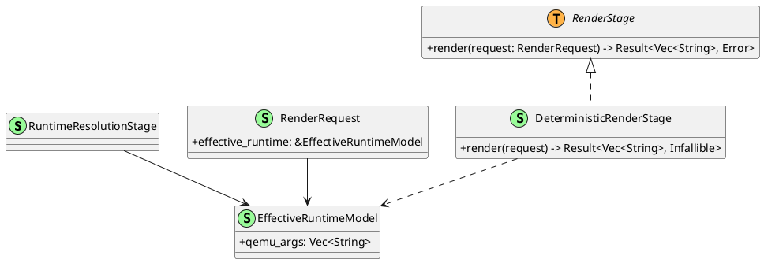
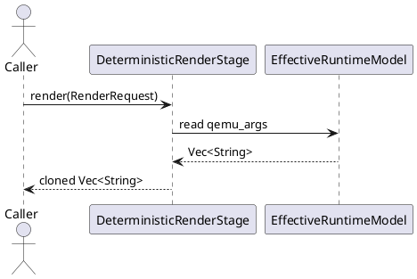

# Runtime Resolution And Render Stage

Back to index: [Current Implementation Architecture](./current-implementation-architecture.md)

## Scope

This note covers stage boundaries in:

- `src/runtime_resolution/mod.rs`
- `src/render_stage/mod.rs`
- `src/render_stage/deterministic.rs`

`RuntimeResolutionStage` and `EffectiveRuntimeModel` currently form a scaffold boundary. `DeterministicRenderStage` is the active renderer implementation.

## Stage Structure

## Current Behavior

- Runtime resolution methods are not yet implemented beyond publishing the effective model shape.
- Deterministic rendering is a pass-through clone of `EffectiveRuntimeModel.qemu_args`.
- The render trait boundary is synchronous and object-safe.

## Render Flow

## Related Docs

- [Model Separation Pipeline Contract](../model-separation-pipeline.md)
- [VM Spec, Parsing, And Validation](./vm-spec-parsing-validation.md)
