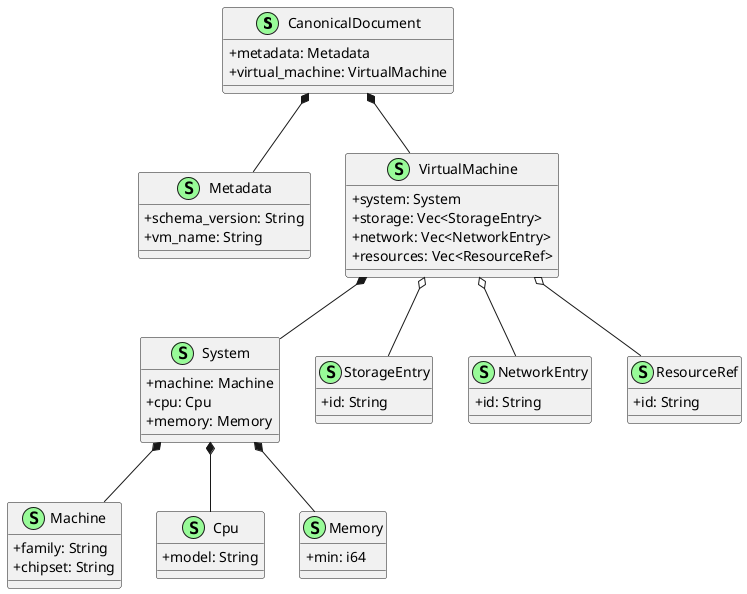
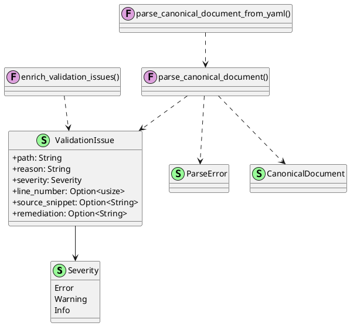
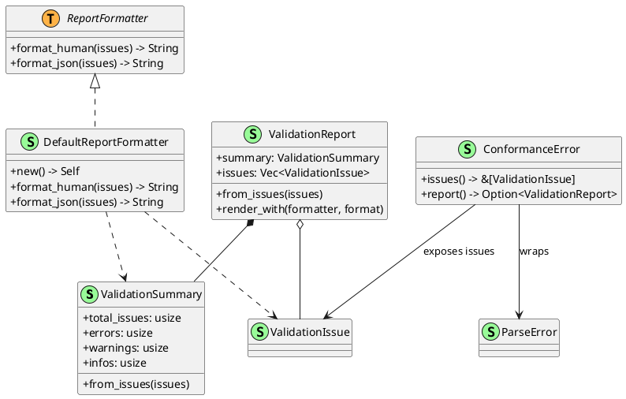
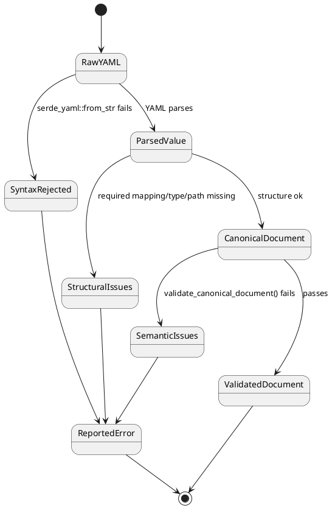

# VM Spec, Parsing, And Validation

Back to index: [Current Implementation Architecture](./current-implementation-architecture.md)

## Scope

This note covers canonical model shape plus parse and validation logic in:

- `src/vm_spec/model.rs`
- `src/vm_spec/parsing.rs`
- `src/vm_spec/validation.rs`
- `src/vm_spec/mod.rs`

## Canonical Model

`CANONICAL_SCHEMA_VERSION` is currently `1.0.0`.
Top-level schema expects `metadata` and `virtual_machine`. `storage`, `network`, and `resources` default to empty vectors.

## Parsing Surface

`parse_canonical_document_from_yaml()` parses YAML text to `serde_yaml::Value` and then feeds structural extraction through `parse_canonical_document()`, collecting `ValidationIssue` values where possible.

## Semantic Validation

`validate_canonical_document()` applies whole-document checks including:

- `metadata.vm_name` matching filename stem when available
- consistency between `machine.family` and `machine.chipset`
- per-scope uniqueness for `storage`, `network`, `resources` IDs
- non-empty required string fields
- non-negative minimum memory

`validate_canonical_yaml()` is the high-level path that parses first, validates second, and enriches issue context before returning `ConformanceError` when needed.

## Validation Failure States

## Related Docs

- [Validation Reporting](../validation-reporting.md)
- [Validation Examples](../validation-examples.md)
- [Runtime Resolution And Render Stage](./runtime-resolution-and-render-stage.md)
