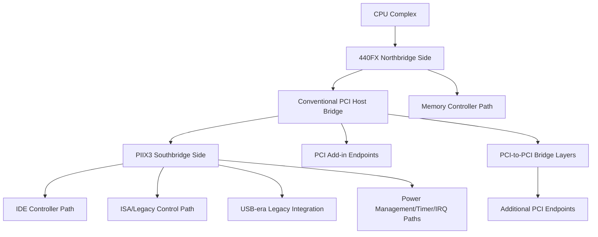

# i440fx Chipset Domain

Date: 2026-05-23
Scope: i440fx chipset architecture and platform-level characteristics only
Purpose: Provide a fallback reference for i440fx topology, buses, device classes, and architectural constraints without virtualization implementation policy.

## 1. Scope and Assumptions

This document is a domain reference for i440fx-era platform architecture.

- Focus: chipset topology, bus roles, device attachment classes, and practical architectural limits.
- Excludes: hypervisor-specific defaults, runtime policy, and project-specific implementation rules.
- Perspective: board/platform architecture, not one specific motherboard SKU.

## 2. i440fx Architectural Model

i440fx belongs to the classic northbridge/southbridge PC chipset generation and is strongly tied to the conventional PCI era.

- Typical historical pairing: Intel 440FX northbridge (82441FX/82442FX) with PIIX-family southbridge (commonly 82371SB/PIIX3).
- Architectural model: CPU and DRAM control centered around northbridge-side logic with platform I/O aggregation in southbridge.
- Platform orientation: compatibility-focused motherboard generation predating PCIe-first layouts.

### 2.1 Canonical Topology View

At a high level, i440fx-class platforms follow this shape:

1. CPU complex connects to northbridge-side host/memory logic.
2. Northbridge side exposes conventional PCI host bridge behavior.
3. Southbridge aggregates ISA/IDE-era and platform-control functions.
4. Board-level add-ons attach through PCI hierarchy and legacy platform paths.

### 2.2 Conceptual Topology Tree

This is a conceptual architecture map (not a machine-specific slot map):

## 3. Bus Inventory and Roles

### 3.1 Bus and Interconnect Matrix

| Bus/Interconnect | Role in i440fx-era platform | Typical attached functions | Key architectural notes |
| --- | --- | --- | --- |
| CPU host interface | CPU to northbridge-side logic | CPU transactions, memory/control path | Governs upstream platform behavior |
| Conventional PCI host bridge path | Main expansion fabric | PCI endpoints, PCI bridges | Shared-bus model, not PCIe point-to-point |
| Northbridge-southbridge link path | Internal chipset interconnect | I/O traffic between 440FX side and PIIX side | Carries southbridge-originated control and device traffic |
| IDE path (southbridge integrated) | Legacy storage interface | IDE/PATA-class storage controllers and devices | Important in compatibility-oriented systems |
| ISA/legacy control path | Legacy platform/control functions | ISA-era compatibility, Super I/O style behavior | Common source of old-OS dependency |
| Timer/interrupt/control paths | Platform control and interrupts | IRQ routing, timers, DMA-related behaviors | Legacy behavior can affect driver assumptions |

### 3.2 Chipset-Native vs Board-Integrated Functions

Chipset-native/common-to-family:

- Conventional PCI host-bridge topology model.
- Southbridge-integrated IDE and legacy control paths.
- Legacy interrupt/timer/control integration patterns.

Board-integrated or optional functions (not guaranteed by chipset alone):

- Discrete NIC silicon.
- Add-on storage or RAID controllers.
- Audio codec and multimedia controller choices.
- Board-management or Super I/O implementation variants.

## 4. Device Placement Model and Topology Patterns

### 4.1 Typical Placement Classes

1. Chipset-integrated functions: exposed through southbridge-side integration.
2. Conventional PCI endpoint functions: attached directly on PCI hierarchy.
3. Bridge-mediated PCI expansions: used when more endpoint fanout is needed.
4. Legacy-oriented board functions: attached through southbridge-era control paths.

### 4.2 Common Topology Patterns

Pattern A: Minimal legacy workstation layout

- One graphics path.
- One NIC path.
- Storage through southbridge-integrated IDE-style path or board storage add-on.

Pattern B: PCI expansion-heavy layout

- Multiple endpoint classes behind PCI-to-PCI bridge depth.
- Increased pressure on bus, slot, and resource assignment planning.

Pattern C: Compatibility-first layout

- Prioritizes stable legacy/control-path behavior.
- Limits bridge complexity to reduce old-driver sensitivity.

## 5. Architectural Limits and Capacity Planning

i440fx platforms are constrained by conventional PCI hierarchy mechanics and legacy resource-accounting behavior.

### 5.1 Bus and Hierarchy Limits

- PCI domain bus numbering is finite.
- Slot/function planning matters directly in shared conventional PCI hierarchy.
- Additional bridge levels increase enumeration and routing complexity.

### 5.2 Resource Pressure Areas

- IO and MMIO pressure grows with bridge and endpoint density.
- Legacy IRQ and routing behavior can become a bottleneck in dense layouts.
- Resource window fragmentation risk grows with complex bridge trees.

### 5.3 Practical Planning Heuristics

- Keep bridge depth as shallow as practical for expected endpoint count.
- Preserve stable slot/function identity for compatibility-sensitive systems.
- Group related device classes predictably to reduce enumeration churn.

## 6. Resource Allocation Model (Reference-Level)

### 6.1 Why Resource Model Matters

In legacy PCI-era layouts, resource and interrupt assignments are often tightly coupled to topology shape.

- BAR outcomes depend on available resource windows and bridge layout.
- Firmware-reported platform structure influences OS interpretation of devices.
- Stable hierarchy and slot identity reduce compatibility regressions.

### 6.2 What to Check During Analysis

When investigating topology-driven behavior differences, check:

1. Bridge depth and fanout.
2. Slot/function identity stability across boots.
3. Resource pressure symptoms (allocation failures, IRQ conflicts, reassignment churn).
4. Consistency of firmware-reported device structure.

## 7. Troubleshooting by Symptom (Chipset-Domain Lens)

### 7.1 Device Not Enumerated

Likely domain causes:

- Resource exhaustion in dense PCI trees.
- Over-complex bridge segmentation.
- Firmware-enumeration side effects in legacy-heavy layouts.

Checks:

1. Reduce bridge depth and retest.
2. Validate hierarchy against intended slot/function plan.
3. Re-check resource and interrupt budget assumptions.

### 7.2 Device Enumerates but Driver Is Unstable

Likely domain causes:

- Slot/function identity drift across boots.
- Legacy IRQ routing side effects under complex topology.

Checks:

1. Verify stable slot/function identity.
2. Simplify hierarchy and reintroduce complexity incrementally.
3. Track which topology change first introduced instability.

### 7.3 Legacy Functionality Regressions

Likely domain causes:

- Broken assumptions around southbridge-era control and compatibility paths.
- Board-integration dependencies mistaken for chipset guarantees.

Checks:

1. Separate chipset-native expectations from board-specific integration behavior.
2. Confirm legacy control-path assumptions against chipset documentation.

## 8. Sources

- Primary/official online sources:
  - Intel 440FX PCIset (82441FX/82442FX) PDF mirror (QEMU wiki): https://wiki.qemu.org/images/b/bb/29054901.pdf
  - Intel 440FX PCIset (82441FX/82442FX) PDF mirror (Bitsavers): http://bitsavers.informatik.uni-stuttgart.de/components/intel/_dataSheets/290549-001_440FX_PCIset_82441FX_82442FX_Prelim_199605.pdf
  - Intel 82371FB/82371SB (PIIX/PIIX3) PDF mirror: https://mark-ogden.uk/files/intel/publications/290550-001%2082371FB%28PIIX%29%20and%2082371SB%28PIIX3%29%20PCI%20ISA%20IDE%20Xcelerator-May96.pdf
  - Intel 440 family archive landing page: https://www.intel.com/design/archives/chipsets/440/index.htm
  - Intel 82441FX datasheet search entry: https://www.intel.com/content/www/us/en/search.html?ws=text#q=82441FX%20datasheet
  - Intel 82371SB datasheet search entry: https://www.intel.com/content/www/us/en/search.html?ws=text#q=82371SB%20datasheet
- Secondary background (context only):
  - Intel 440FX background: https://en.wikipedia.org/wiki/Intel_440FX
  - Conventional PCI architecture background: https://en.wikipedia.org/wiki/Conventional_PCI

## Validation

- Reviewed for scope purity: i440fx chipset-domain only, no QEMU behavior or ezkvm policy.
- Verified source identity from downloaded copies during research, then mapped citations to online source URLs.
- Claims are based on vendor-source material with online citations; secondary links are context only.

## Primary Source Request (Manual Download)

Please provide these primary vendor documents to further strengthen completeness and citation depth:

- Intel 440FX/PIIX3 specification update documents or platform design guides, if available from Intel archives.

## Source Reliability Note

This document is chipset-domain background. Runtime behavior and virtualization policy are documented separately.
Primary vendor sources are preferred; secondary references above are context-only support.
