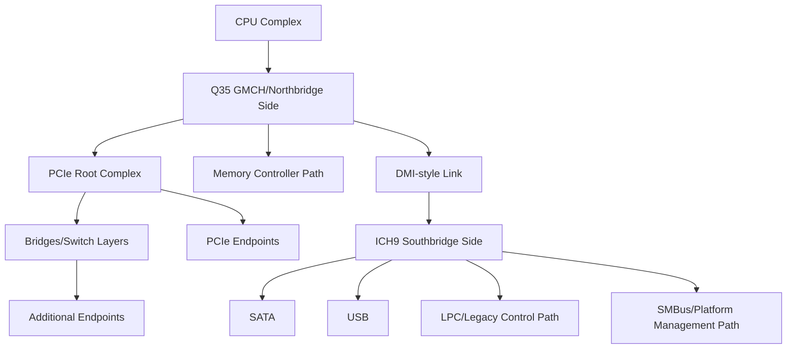

# Q35 Chipset Domain

Date: 2026-05-23
Scope: Q35 chipset architecture and platform-level characteristics only
Purpose: Provide a fallback reference for Q35 topology, buses, device classes, and architectural constraints without virtualization implementation policy.

## 1. Scope and Assumptions

This document is a domain reference for Q35-era platform architecture.

- Focus: chipset topology, bus roles, device attachment classes, and practical architectural limits.
- Excludes: hypervisor-specific defaults, runtime policy, and project-specific implementation rules.
- Perspective: board/platform architecture, not one specific motherboard SKU.

## 2. Q35 Architectural Model

Q35 belongs to the split-chipset generation where host/memory-controller-side logic and platform I/O aggregation are separated into distinct components.

- Typical pairing in physical systems: Intel Q35 GMCH with ICH9-family southbridge variants.
- Architectural model: host-side memory and graphics-facing logic on the northbridge side, platform I/O aggregation on the southbridge side.
- Platform orientation: PCI Express-era desktop/workstation chipset generation.

### 2.1 Canonical Topology View

At a high level, Q35 platforms follow this shape:

1. CPU complex connects to northbridge/GMCH-class logic.
2. Northbridge side exposes PCIe-era root-complex behavior.
3. Southbridge (ICH9 family) aggregates platform I/O and legacy-oriented interfaces.
4. Board-level add-ons attach through chipset-exposed buses.

### 2.2 Conceptual Topology Tree

This is a conceptual architecture map (not a machine-specific slot map):

## 3. Bus Inventory and Roles

### 3.1 Bus and Interconnect Matrix

| Bus/Interconnect | Role in Q35-era platform | Typical attached functions | Key architectural notes |
| --- | --- | --- | --- |
| CPU host interface | CPU to northbridge-side logic | CPU transactions, memory/control path | Governs upstream platform behavior |
| PCIe root-complex path | High-bandwidth expansion fabric | PCIe endpoints, downstream ports/bridges | Hierarchy planning is central |
| DMI-style northbridge-southbridge link | Internal chipset interconnect | I/O traffic between GMCH and ICH9 side | Shared path for southbridge-originated traffic |
| SATA (southbridge integrated) | Storage host interface | SATA disks/optical devices | Southbridge-managed storage class path |
| USB (southbridge integrated) | External peripheral interface | USB controllers/devices | Controller generation depends on chipset/southbridge variant |
| LPC/legacy path | Legacy platform/control functions | Super I/O style functions, legacy control blocks | Important for compatibility-oriented boards |
| SMBus/platform management path | Low-speed management/control | Sensors, board management endpoints | Primarily control/telemetry scope |

### 3.2 Chipset-Native vs Board-Integrated Functions

Chipset-native/common-to-family:

- Root-complex-oriented expansion model.
- Southbridge-integrated platform I/O classes (for example SATA, USB, LPC-oriented control path).
- Internal northbridge/southbridge interconnect behavior.

Board-integrated or optional functions (not guaranteed by chipset alone):

- Discrete NIC silicon.
- Optional RAID/HBA add-on controllers.
- Board-management variants.
- Audio codec implementations and wiring choices.

## 4. Device Placement Model and Topology Patterns

### 4.1 Typical Placement Classes

1. Chipset-integrated functions: exposed through southbridge-side integration.
2. PCIe endpoint functions: attached through root-complex hierarchy.
3. Bridge-mediated expansions: used when fanout or segmentation is required.
4. Legacy-oriented add-ons: often represented through southbridge-connected legacy/control paths.

### 4.2 Common Topology Patterns

Pattern A: Minimal workstation-like layout

- One GPU-class endpoint path.
- One NIC path.
- Storage via southbridge-integrated SATA path.

Pattern B: Expansion-heavy layout

- Multiple endpoint classes behind additional bridge/switch depth.
- Increased pressure on bus numbering, routing, and firmware-resource bookkeeping.

Pattern C: Compatibility-oriented layout

- Prioritizes stable legacy/control-path behavior.
- Uses simpler endpoint hierarchy where possible.

## 5. Architectural Limits and Capacity Planning

Q35 platforms are constrained by generic PCI/PCIe hierarchy mechanics and platform resource accounting.

### 5.1 Bus and Hierarchy Limits

- PCI/PCIe domain bus numbering is finite.
- Each additional hierarchy level consumes routing and enumeration budget.
- Deep fanout increases complexity in discovery, initialization order, and troubleshooting.

### 5.2 Resource Pressure Areas

- IO and MMIO allocation pressure increases with many endpoints and bridges.
- More complex bridge trees increase windows/forwarding requirements.
- Interrupt/resource routing complexity grows with topology depth and device count.

### 5.3 Practical Planning Heuristics

- Keep hierarchy as shallow as practical for expected device scale.
- Reserve fanout depth for real expansion requirements, not speculative layout.
- Prefer predictable structural grouping so enumeration behavior remains stable.

## 6. Resource Allocation Model (Reference-Level)

### 6.1 Why Resource Model Matters

Even without changing silicon generation, platform behavior changes when topology forces different resource layout.

- BAR allocation outcomes depend on available resource windows.
- Firmware tables and initialization logic influence how an OS sees the topology.
- Stable slot/function identity and hierarchy shape reduce driver churn risk.

### 6.2 What to Check During Analysis

When investigating topology-driven behavior differences, check:

1. Hierarchy depth and bridge fanout.
2. Device class distribution across the hierarchy.
3. Resource pressure symptoms (allocation failures, reassignment churn).
4. Consistency of firmware-reported topology metadata.

## 7. Troubleshooting by Symptom (Chipset-Domain Lens)

### 7.1 Device Not Enumerated

Likely domain causes:

- Resource exhaustion in a dense hierarchy.
- Misplanned bridge segmentation.
- Firmware-enumeration side effects in deep topologies.

Checks:

1. Reduce hierarchy depth and retest.
2. Validate bridge tree structure against intended design.
3. Re-check resource budget assumptions.

### 7.2 Device Enumerates but Behaves Unreliably

Likely domain causes:

- Topology instability across boots.
- Edge-case interactions in complex bridge trees.

Checks:

1. Verify topology identity remains stable.
2. Simplify tree and reintroduce complexity incrementally.
3. Track which hierarchy change first introduced instability.

### 7.3 Legacy-Oriented Functionality Regressions

Likely domain causes:

- Assumptions about southbridge-era control/legacy paths broken by topology changes.
- Board-integration dependencies mistaken for chipset guarantees.

Checks:

1. Separate chipset-native expectations from board-specific integrations.
2. Confirm legacy/control-path assumptions against platform docs.

## 8. Sources

- Primary/official online sources:
  - Intel ICH9 Family Datasheet: https://www.intel.com/content/dam/doc/datasheet/io-controller-hub-9-datasheet.pdf
  - Intel ICH9 Family Thermal and Mechanical Design Guidelines: https://www.intel.la/content/dam/doc/design-guide/io-controller-hub-9-family-guidelines.pdf
  - Intel Q35 and Q33 Express Chipsets Product Brief: https://www.intel.com/content/dam/www/public/us/en/documents/product-briefs/q35-chipset-brief.pdf
  - Intel Q35/Q33, G35/G33/G31, P35/P31 Express Chipset Memory Technology and Configuration Guide (doc id 316971): https://www.intel.com/content/www/us/en/search.html?ws=text#q=316971
  - Intel Core 2 Duo Processor and Intel Q35 Express Chipset Development Kit User's Manual (doc id 318476): https://www.intel.com/content/www/us/en/search.html?ws=text#q=318476
- Intel search entry points (when direct links are blocked):
  - Q35 Express Chipset Datasheet search: https://www.intel.com/content/www/us/en/search.html?ws=text#q=Q35%20Express%20Chipset%20Datasheet
  - ICH9 datasheet search: https://www.intel.com/content/www/us/en/search.html?ws=text#q=ICH9%20datasheet
- Secondary background (context only):
  - Intel Q35 family historical context: https://en.wikipedia.org/wiki/List_of_Intel_chipsets
  - Northbridge/southbridge architecture background: https://en.wikipedia.org/wiki/Northbridge_(computing)

## Validation

- Reviewed for scope purity: Q35 chipset-domain only, no QEMU behavior or project policy.
- Verified source identity from downloaded copies during research, then mapped citations to online source URLs.
- Claims are based on vendor-source material with online citations; secondary links are context only.

## Primary Source Request (Manual Download)

Please provide these primary vendor documents to further strengthen completeness and citation depth:

- Intel Q35 Express Chipset Datasheet (82Q35 GMCH), if available from Intel archives.
- Intel Q35/ICH9 specification update document, if available from Intel archives.

## Source Reliability Note

This document is chipset-domain background. Runtime behavior and virtualization policy are documented separately.
Primary vendor sources are preferred; secondary references above are context-only support.
