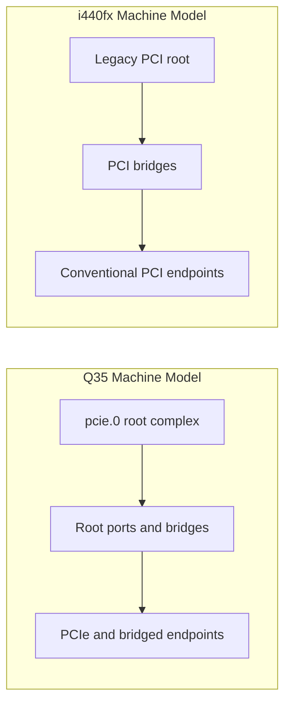

# QEMU Behavior for Q35 and i440fx

Date: 2026-05-24
Scope: QEMU machine-model internals, bus topology construction, and device placement semantics for Q35 and i440fx
Purpose: Provide a technical reference for understanding how QEMU builds and realizes Q35 and i440fx machine models.

## 1. Scope and Reader Model

This note is written for engineers who need to reason about QEMU machine internals and guest-visible topology outcomes.

- Focus: machine-type realization, bus construction, device-add resolution, and bridge/topology side effects.
- Excludes: project-specific policy (for example ezkvm defaults or workflow rules).
- Audience assumption: familiarity with QEMU CLI concepts and PCI/PCIe architecture.

## 2. Machine Types as Hardware Contracts

In QEMU, machine type and machine version are part of the guest-visible hardware contract.

- `q35` / `pc-q35-*`: PCIe-first model with a root complex and PCIe-oriented hierarchy expectations.
- `pc` / `pc-i440fx-*`: legacy PCI-centric model with PIIX-style platform assumptions.
- Versioned machine types matter because even small compatibility deltas can alter guest-visible behavior.

Practical consequence:

1. Treat machine choice as architecture, not cosmetic syntax.
2. Treat machine version pinning as compatibility-critical.

## 3. Realization Pipeline: How QEMU Builds the Board

At a high level, board construction follows this sequence:

1. Machine class is selected from `-machine`.
2. Machine init/realize path wires chipset host bridge and platform devices.
3. Root bus(es) are created and named.
4. Device-add paths resolve bus/address defaults if user omitted explicit placement.
5. Final topology is realized and exposed to firmware/guest.

Implementation touchpoints:

- `hw/i386/pc_q35.c`: Q35 machine wiring and board realization.
- `hw/i386/pc_piix.c`: i440fx/PIIX machine wiring.
- `hw/pci-host/q35.c`: Q35 host bridge and PCIe root bus creation.
- `system/qdev-monitor.c`: device add flow and default bus lookup.
- `hw/pci/pci.c`: PCI registration and devfn assignment.

## 4. Bus Construction and Topology Model

### 4.1 Q35 Topology Model in QEMU

Q35 is PCIe-first in QEMU machine modeling.

- Root PCIe bus is created as `pcie.0` in Q35 host bridge realization.
- PCIe hierarchy planning is central: endpoints, root ports, and bridge layering drive guest-visible topology.
- Conventional PCI devices can still appear through bridge-mediated paths when needed.

### 4.2 i440fx Topology Model in QEMU

i440fx is legacy PCI-centric in QEMU machine modeling.

- Topology assumptions are oriented around conventional PCI host-bridge behavior.
- PIIX-style platform wiring represents classic compatibility paths.
- Hierarchy is usually flatter in simple cases, but bridge layering still affects resource/routing outcomes.

### 4.3 Conceptual Model Contrast

## 5. Device Add Semantics: Inner Workings

### 5.1 Default Bus Resolution

When `-device` does not provide `bus=`, QEMU resolves bus placement from the device class bus type.

- `qdev_device_add_from_qdict()` follows default bus lookup paths.
- Lookup walks candidate buses from the system-bus context to find a matching bus type.
- For PCI-class devices, this leads to machine-dependent defaults (Q35 versus i440fx behavior differs by available root hierarchy).

Implementation touchpoints:

- `system/qdev-monitor.c`: `qdev_device_add_from_qdict()`, default bus lookup logic.
- `hw/pci/pci.c`: PCI bus-type integration in class/device registration paths.

### 5.2 Address (`addr`) Parsing and Devfn Semantics

For PCI devices, `addr` maps to devfn semantics.

- `addr=<slot>` implies slot with function `0`.
- `addr=<slot>.<fn>` implies explicit slot/function pair.
- Omitted `addr` keeps auto-assignment behavior (devfn sentinel path).

Implementation touchpoints:

- `hw/core/qdev-properties-system.c`: devfn parse/format helpers.
- `hw/pci/pci.c`: property definition and register-time assignment logic.

### 5.3 Auto-Assignment Behavior

When devfn is auto-assigned:

- QEMU performs deterministic first-fit search over eligible positions.
- Outcome depends on already-realized devices and reserved slots.
- Changes in realization order or topology shape can shift where an implicitly placed device lands.

Engineering implication:

- Implicit placement is deterministic for a fixed topology state, but topology state itself is sensitive to ordering and bridge structure.

## 6. Bridge Behavior and Topology Side Effects

### 6.1 Bridge Types and Their Role

- PCIe-side bridge hierarchy controls fanout and bus consumption in Q35-style layouts.
- Conventional PCI bridge hierarchy controls fanout in i440fx-style layouts.
- `pcie-pci-bridge` can connect conventional PCI endpoints into PCIe-centric trees.

### 6.2 Side Effects That Matter in Practice

- Every additional bridge layer consumes bus-number budget and routing complexity.
- Deep bridge trees can increase IO/MMIO pressure and troubleshooting complexity.
- Guest-visible enumeration order and resource assignment may shift as topology depth changes.

## 7. Hotplug and Discoverability Model

Hotplug capability and behavior depend on topology path, not only on endpoint device type.

- PCIe-native paths and conventional PCI paths have different operational semantics.
- Planning for hotplug requires selecting attachment points that expose intended capabilities.
- Incorrect attachment layer can produce a valid boot but wrong operational behavior envelope.

## 8. Q35 vs i440fx: Practical Internal Differences

### 8.1 Where Q35 Is More Sensitive

- Root-complex and root-port architecture choices.
- Bus-number budgeting in expansion-heavy topologies.
- Mixing PCIe and bridged conventional PCI endpoints.

### 8.2 Where i440fx Is More Sensitive

- Legacy PCI slot/function stability.
- Legacy routing/compatibility assumptions.
- Bridge depth effects on older driver/resource behavior.

### 8.3 Shared Sensitivities

- Device realization order affects implicit placement results.
- Bridge hierarchy complexity affects resource/routing behavior.
- Machine version changes can shift guest-visible details.

## 9. Analysis and Debug Checklist

When topology or placement does not match expectation, inspect in this order:

1. Machine type and version (`q35` vs `pc-i440fx-*`).
2. Explicit versus implicit `bus` and `addr` usage.
3. Device realization order and whether order changed.
4. Bridge tree depth and fanout.
5. Final effective slot/function outcomes.
6. Guest-visible resource assignment side effects.

## 10. Parity-Oriented Notes for QEMU-Compatible Model Builders

For tools that aim at QEMU parity (for example model builders/importers):

- Preserve machine type/version semantics as first-class state.
- Preserve explicit bus/address/chassis/port wiring when available.
- Model implicit placement as a function of realized topology state, not a standalone default.
- Evaluate topology changes by guest-visible deltas, not only CLI similarity.

## 11. Sources

- QEMU PCIe design notes: https://raw.githubusercontent.com/qemu/qemu/master/docs/pcie.txt
- QEMU PCIe-to-PCI bridge notes: https://raw.githubusercontent.com/qemu/qemu/master/docs/pcie_pci_bridge.txt
- QEMU i386 machine docs: https://www.qemu.org/docs/master/system/i386/pc.html
- QEMU i386 machine docs source: https://raw.githubusercontent.com/qemu/qemu/master/docs/system/i386/pc.rst
- QEMU source references reviewed:
  - `system/qdev-monitor.c`
  - `hw/core/qdev-properties-system.c`
  - `hw/pci/pci.c`
  - `hw/pci-host/q35.c`
  - `hw/i386/pc_q35.c`
  - `hw/i386/pc_piix.c`

## Validation

- Reviewed for scope purity: QEMU behavior and machine internals only.
- Structured for reference use: architecture, internals, side effects, and troubleshooting path.
- Claims are anchored to upstream QEMU docs and source references.

## Source Reliability Note

Upstream QEMU documentation and source are the authority for this file.
