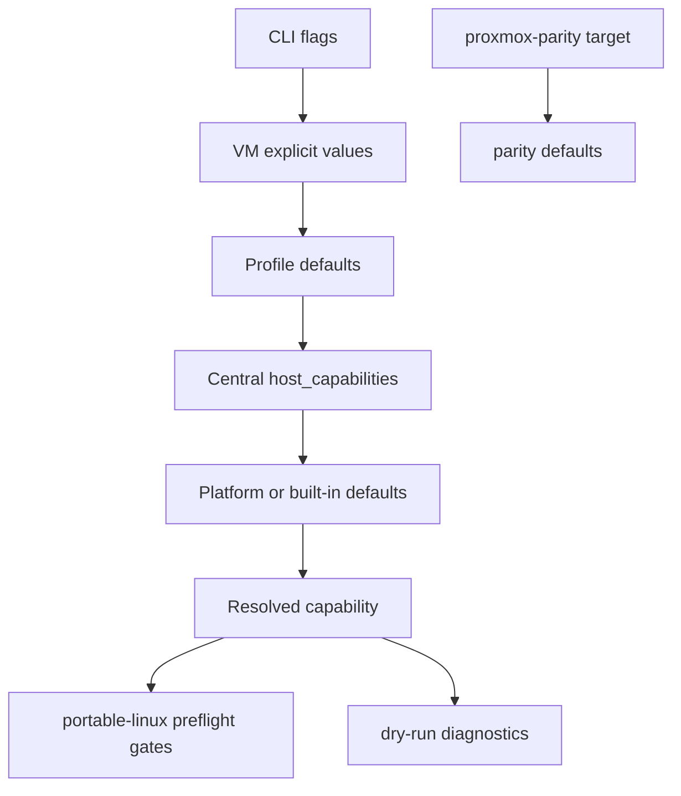

# Proxmox Import And Portable Runtime Operator Guide

This guide focuses on operating imported Proxmox VMs with ezkvm portable runtime defaults (`portable-linux`, the default target), while still documenting when parity mode is the right choice.

## Choose The Right Runtime Target

| Target | Use when | Behavior |
| --- | --- | --- |
| `portable-linux` (default) | You want host-independent operation across Debian/Ubuntu/Arch and non-Proxmox hosts | Resolves runtime capabilities from CLI/VM/profile/central/platform sources and applies preflight validation |
| `proxmox-parity` | You need strict Proxmox runtime path/script behavior for compatibility checks or staged migration | Preserves parity defaults and bypasses portable capability gates |

Import examples:

```bash
# default: portable-linux
ezkvm import-proxmox /etc/pve/qemu-server/108.conf --dry-run

# explicit parity mode
ezkvm import-proxmox /etc/pve/qemu-server/108.conf --runtime-target proxmox-parity --dry-run
```

## Capability Precedence Flow



Portable mode enforces capability validation. Parity mode keeps parity defaults and does not enforce portable capability gates.

## Host Requirements By Distro

### Debian Trixie (example)

- QEMU system binaries
- OVMF firmware files
- `swtpm`
- `qemu-bridge-helper` (if bridge networking is required)

```bash
sudo apt update
sudo apt install -y qemu-system-x86 ovmf swtpm qemu-system-common
```

### Ubuntu 26.04 (example)

```bash
sudo apt update
sudo apt install -y qemu-system-x86 ovmf swtpm qemu-system-common
```

### Arch Linux (example)

```bash
sudo pacman -Syu --noconfirm qemu-full ovmf swtpm
```

Notes:

- Package names can vary by mirror/release. Validate with `ezkvm start ... --dry-run` diagnostics.
- For bridge mode, ensure the helper path and `/dev/net/tun` permissions are correct.

## Quick Start (Copy/Paste)

### Debian/Ubuntu portable import

```bash
export EZKVM_CONFIG=/etc/ezkvm.yaml
ezkvm import-proxmox /etc/pve/qemu-server/108.conf --proxmox-storage /etc/pve/storage.cfg --dry-run
ezkvm import-proxmox /etc/pve/qemu-server/108.conf --proxmox-storage /etc/pve/storage.cfg --output 108.yaml
ezkvm start 108.yaml --dry-run
ezkvm start 108.yaml
```

### Arch portable import

```bash
export EZKVM_CONFIG=/etc/ezkvm.yaml
ezkvm import-proxmox /etc/pve/qemu-server/108.conf --proxmox-storage /etc/pve/storage.cfg --output 108.yaml
ezkvm start 108.yaml --dry-run
```

### Parity validation run

```bash
ezkvm import-proxmox /etc/pve/qemu-server/108.conf --runtime-target proxmox-parity --output 108-parity.yaml
ezkvm start 108-parity.yaml --dry-run
```

## Bridge Networking Setup (Portable Mode)

### iproute2 flow

```bash
sudo ip link add br0 type bridge
sudo ip link set br0 up
sudo ip link set enp3s0 master br0
```

### qemu-bridge-helper allowlist

```bash
sudo install -d -m 0755 /etc/qemu
echo "allow br0" | sudo tee /etc/qemu/bridge.conf
```

### netctl-style flow (where applicable)

- Define bridge profile
- enslave host uplink
- bring profile up before VM launch

### udev/device permissions hints

- Ensure the VM-launching user can access `/dev/net/tun`
- Ensure Looking Glass users can access `/dev/kvmfr0` when enabled

If bridge helper cannot be resolved, portable mode downgrades bridge NICs to user-mode with a warning.

## Central Config Examples

All examples assume `host_capabilities` is defined in central config. See [central-config.md](central-config.md) for full schema.

### Debian-like baseline

```yaml
host_capabilities:
  runtime:
    run_dir: /var/run/ezkvm
  firmware:
    search_paths:
      - /usr/share/ovmf
      - /usr/share/OVMF
  tpm:
    swtpm_binary: /usr/bin/swtpm
  network:
    bridge_helper: /usr/lib/qemu/qemu-bridge-helper
    bridge_name: br0
  integrations:
    remote_viewer:
      program: /usr/bin/remote-viewer
    looking_glass:
      program: /usr/bin/looking-glass-client
      shared_memory_device: /dev/kvmfr0
```

### Arch-like baseline

```yaml
host_capabilities:
  firmware:
    search_paths:
      - /usr/share/ovmf
  network:
    bridge_helper: /usr/lib/qemu/qemu-bridge-helper
  tpm:
    swtpm_binary: /usr/bin/swtpm
```

### Multi-VM shared central config

Use one central file for host defaults and keep per-VM files guest-focused.

```yaml
locations:
  profile_dir: /etc/ezkvm/profiles.d

host_capabilities:
  runtime:
    run_dir: /var/run/ezkvm
  network:
    bridge_name: br0
```

Then launch VMs with only VM-local overrides where required:

```bash
ezkvm start vm-a.yaml --dry-run
ezkvm start vm-b.yaml --run-dir /srv/ezkvm/run
```

## CLI Override Examples

```bash
ezkvm start 108.yaml \
  --run-dir /tmp/ezkvm \
  --swtpm-binary /usr/bin/swtpm \
  --tpm-socket-path /tmp/ezkvm/108.swtpm \
  --ovmf-dir /usr/share/OVMF \
  --remote-viewer-program /usr/bin/remote-viewer \
  --looking-glass-program /usr/bin/looking-glass-client \
  --dry-run
```

Use `--dry-run` first to confirm resolved source/value diagnostics.

## Preflight Failures And Resolutions

| Error pattern | Meaning | Typical fix |
| --- | --- | --- |
| `required swtpm binary ... is not available` | TPM emulator in socket mode cannot find `swtpm` | Set `--swtpm-binary`, configure `host_capabilities.tpm.swtpm_binary`, or install `swtpm` |
| `UEFI firmware requested but no OVMF file found` | UEFI requested but firmware discovery failed | Set `--ovmf-dir` or add firmware `search_paths` |
| `runtime run directory ... is not writable` | Runtime path permission issue | Choose writable `--run-dir` or adjust host permissions |
| `network ... downgraded to user-mode` | Bridge helper unavailable/policy-forced user mode | Install/configure bridge helper or adjust `preferred_backend` |

## Looking Glass Optional Setup

Portable mode supports optional Looking Glass integration:

- `mode: explicit`: fail fast if client is not resolvable
- `mode: auto`: use when found, otherwise skip
- `mode: disabled`: never launch client

Example:

```yaml
options:
  looking_glass:
    mode: auto
```

For explicit deployments, configure `host_capabilities.integrations.looking_glass.program` and verify `/dev/kvmfr0` permissions.

## Troubleshooting Capability Discovery

1. Run dry-run and inspect diagnostics:

```bash
ezkvm start 108.yaml --dry-run
```

2. Confirm reported source/value lines for:

- `runtime_root`
- `swtpm_binary` (when TPM emulator is enabled)
- `ovmf_code` (when UEFI/OVMF is enabled)
- `looking_glass_program`
- `network[<id>]` entries

3. Narrow scope with temporary CLI overrides to confirm whether central config or host paths are the issue.

4. Compare portable and parity imports when debugging migration differences:

```bash
ezkvm import-proxmox ... --runtime-target portable-linux --dry-run
ezkvm import-proxmox ... --runtime-target proxmox-parity --dry-run
```

## Migration: Parity-Only To Portable

1. Import with `portable-linux` (default) and keep parity output for comparison.
2. Run `start --dry-run` and resolve all required preflight failures first.
3. Move host-specific literals into central `host_capabilities`.
4. Keep parity mode only for workloads that still require strict Proxmox path/script behavior.
5. Once validated, standardize operations on portable imports.

## Portable Q35 Topology Defaults

When importing Q35 VMs with `portable-linux`, ezkvm loads
`/usr/share/ezkvm/ezkvm-q35.cfg` and exposes both PCIe and legacy placement
buses so imported layouts can stay closer to Proxmox semantics.

Portable Q35 bus layout used by import defaults:

- `pcie.0`: PCIe root complex
- `ich9-pcie-port-1..8`: dedicated PCIe root ports at `0x1c.0`–`0x1c.7`,
  auto-assigned for PCIe passthrough devices when no explicit hostpci bus is set
- `ehci.0`: USB 2.0 high-speed bus (ICH9 EHCI at `0x1d.7` + UHCI companions
  at `0x1d.0`–`0x1d.2`); `usb-tablet` input devices are placed here automatically
- `pci.0`..`pci.3`: four legacy PCI buses backed by `i82801b11-bridge` (ICH9
  DMI-to-PCI at `0x1e`) feeding four `pci-bridge` subordinates, matching the
  `pve-q35-4.0.cfg` layout

Current portable Q35 placement defaults for imported Proxmox VMs:

- Audio controller (`ich9-intel-hda`): `bus: pci.2`, `addr: 0xc`
- XHCI controller (when USB passthrough exists): `bus: pci.1`, `addr: 0x1b`
- `usb-tablet` input device: placed on `ehci.0,port=1` when a Q35 readconfig is loaded
- Guest-agent and balloon defaults remain on `pcie.0` unless explicitly overridden

## Import Mapping Reference

For field-level mapping reference:

| Proxmox input | ezkvm output | Notes |
| --- | --- | --- |
| `name` | `name` | Can be overridden by import CLI name argument. |
| `cores`, `sockets`, `cpu` | `system.cpu.*` | `cpu.flags` converted from semicolon to comma list. |
| `memory` | `system.memory.size` | MiB value preserved. |
| `bios` / `efidisk0` | `system.boot.*` | `efidisk0` implies UEFI when BIOS is absent. |
| `tpmstate0` | `system.tpm` | Requires resolvable absolute source path. |
| `netN` with `bridge` | `devices.networks[]` | Uses canonical network backend mapping. |
| `hostpciN` | `host.pci[]` | Preserves passthrough placement and multifunction grouping. On portable Q35, missing hostpci bus values auto-allocate across `ich9-pcie-port-1..8` from `ezkvm-q35.cfg`, then fall back to `pcie.0` with a warning. `x-vga` is not a reliable runtime parity indicator for imports that use shorthand hostpci entries (for example `0000:03:00` without explicit `.0`). |
| `usbN` | `host.usb[]` | Supports `<bus>-<port>` and `<vendor>:<product>` selectors. |

## See Also

- [central-config.md](central-config.md)
- [troubleshooting.md](troubleshooting.md)
- [vm-structure.md](vm-structure.md)
