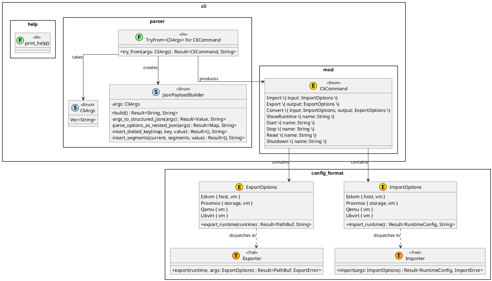
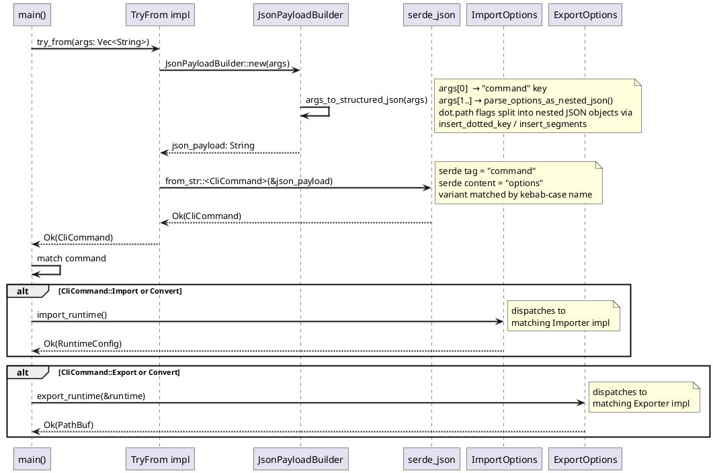

src/cli/README.md

# CLI Module

Handles all command-line interface parsing, validation, and help display for the ezkvm tool.

## Structure

- `mod.rs` - Module exports and public API
- `parser.rs` - Command-line argument parsing logic
- `help.rs` - Help message and usage display

## Syntax

Command syntax uses subcommands with explicit named flags:
```
ezkvm <subcommand> [flags]
```

Where `<subcommand>` is one of:
- `import`: import a vm config from an input format.
- `export`: export a vm config to an output format.
- `convert`: import from one format and export to another.
- `show-runtime --name <name>`: show runtime data for vm `<name>`.
- `start --name <name>`: start vm `<name>`.
- `stop --name <name>`: stop vm `<name>`.
- `reset --name <name>`: reset vm `<name>`.
- `shutdown --name <name>`: shutdown vm `<name>`.

Input flags:
- `--input.type <type>`: importer type.
  - `<type>` is one of:
    - `ezkvm`: native ezkvm format.
      - `--input.host <path>`: path and filename of the ezkvm host config file to read.
      - `--input.vm <path>`: path and filename of the ezkvm vm config file to read.
    - `proxmox`: proxmox config format.
      - `--input.storage <path>`: path and filename of the proxmox storage config file to read.
      - `--input.vm <path>`: path and filename of the proxmox vm config file to read.
    - `qemu`: qemu commandline input format.
      - `--input.vm <path>`: path and filename of the qemu commandline file to read.

Output flags:
- `--output.type <type>`: exporter type.
  - `<type>` is one of:
    - `qemu`: qemu commandline export format.
      - no additional output flags are required.
    - `ezkvm`: native ezkvm format.
      - `--output.host <path>`: path and filename of the ezkvm host config file to read.
      - `--output.vm <path>`: path and filename of the ezkvm vm config file to write.
    - `proxmox`: proxmox config format.
      - `--output.storage <path>`: path and filename of the proxmox storage config file to write.
      - `--output.vm <path>`: path and filename of the proxmox vm config file to write.
    - `libvirt`: libvirt xml export format.
      - `--output.vm <path>`: path and filename of the libvirt xml file to write.

`<name>` is the name of the referenced virtual machine.

In the future, new subcommands and flags may be added while preserving this explicit named-flag style.

### Examples

Import an ezkvm input config:
```bash
ezkvm import \
  --input.type ezkvm \
  --input.host /etc/ezkvm/host.yaml \
  --input.vm /etc/ezkvm/vm/myvm.yaml
```

Import ezkvm and export as proxmox:
```bash
ezkvm convert \
  --input.type ezkvm \
  --input.host /etc/ezkvm/host.yaml \
  --input.vm /etc/ezkvm/vm/myvm.yaml \
  --output.type proxmox \
  --output.storage /etc/pve/storage.cfg \
  --output.vm /etc/pve/qemu-server/101.conf
```

Import ezkvm and export as qemu commandline:
```bash
ezkvm convert \
  --input.type ezkvm \
  --input.host /etc/ezkvm/host.yaml \
  --input.vm /etc/ezkvm/vm/myvm.yaml \
  --output.type qemu
```

Import proxmox and export as ezkvm:
```bash
ezkvm convert \
  --input.type proxmox \
  --input.storage /etc/pve/storage.cfg \
  --input.vm /etc/pve/qemu-server/101.conf \
  --output.type ezkvm \
  --output.host /etc/ezkvm/host.yaml \
  --output.vm /etc/ezkvm/vm/101.yaml
```

Export an existing vm model as proxmox:
```bash
ezkvm export \
  --output.type proxmox \
  --output.storage /etc/pve/storage.cfg \
  --output.vm /etc/pve/qemu-server/101.conf
```

Note: standalone `export` is currently a placeholder and returns an error. Use `convert` for import+export flow.

Show runtime, start, stop, reset, and shutdown by vm name:
```bash
ezkvm show-runtime --name myvm
ezkvm start --name myvm
ezkvm stop --name myvm
ezkvm reset --name myvm
ezkvm shutdown --name myvm
```

## Parsing

Recommend to parse this in two passes, first convert the cli syntax into a json syntax, and then subsequently parse the resulting json into an appropriate CliCommand structure using serde.

### Generic structure

Command:
```bash
ezkvm <command> \
    --<option1>.<property1> <value1> \
    --<option1>.<property2>.<property2.1> <value2.1> \
    --<option2>.<property3> <value3>
```

Intermediate json:
```json
{
  "command": <command>,
  "options": {
    "<option1>": {
      <property1>: <value1>,
      <property2>: {
          <property2.1>: <value2.1>
       },
    },
    "<option2>": {
      <property3>: <value3>,
    }
  }
}
```

### Examples

Command:
```bash
ezkvm import \
  --input.type ezkvm \
  --input.host /etc/ezkvm/host.yaml \
  --input.vm /etc/ezkvm/vm/myvm.yaml \
```

Intermediate json:
```json
{
  "command": "import",
  "options": {
    "input": {
      "type": "ezkvm",
      "host": "/etc/ezkvm/host.yaml",
      "vm": "/etc/ezkvm/vm/myvm.yaml"
    }
  }
}
```

Resulting rust enum variant (by parsing with serde_yaml):
```rust
let parsed_cli = CliCommand::Import {
  input: ImportOptions::Ezkvm {
    host: "/etc/ezkvm/host.yaml".to_string(),
    vm: "/etc/ezkvm/vm/myvm.yaml".to_string(),
  },
};
```

Command:
```bash
ezkvm convert \
  --input.type proxmox \
  --input.storage /etc/pve/storage.cfg \
  --input.vm /etc/pve/qemu-server/101.conf \
  --output.type ezkvm \
  --output.host /etc/ezkvm/host.yaml \
  --output.vm /etc/ezkvm/vm/101.yaml
```

Intermediate json:
```json
{
  "command": "convert",
  "options": {
    "input": {
      "type": "proxmox",
      "storage": "/etc/pve/storage.cfg",
      "vm": "/etc/pve/qemu-server/101.conf"
    },
    "output": {
      "type": "ezkvm",
      "host": "/etc/ezkvm/host.yaml",
      "vm": "/etc/ezkvm/vm/101.yaml"
    }
  }
}
```

Resulting rust enum variant (by parsing with serde_yaml):
```rust
let parsed_cli = CliCommand::Convert {
  input: ImportOptions::Proxmox {
    storage: "/etc/pve/storage.cfg".to_string(),
    vm: "/etc/pve/qemu-server/101.conf".to_string(),
  },
  output: ExportOptions::Ezkvm {
    host: "/etc/ezkvm/host.yaml".to_string(),
    vm: Some("/etc/ezkvm/vm/101.yaml".to_string()),
  },
};
```

### Design

#### Type Overview

The CLI module defines the following key types, spread across three source files.

| Symbol | Kind | File | Role |
|---|---|---|---|
| `CliArgs` | Struct (type alias) | `parser.rs` | Raw `Vec<String>` received from the OS |
| `JsonPayloadBuilder` | Struct | `parser.rs` | Converts flat `--dot.path value` flags into nested JSON |
| `TryFrom<CliArgs> for CliCommand` | Impl (Fn) | `parser.rs` | Entry point: wires args → builder → deserialization |
| `CliCommand` | Enum | `mod.rs` | Discriminated union of all supported subcommands |
| `ImportOptions` | Enum | `config_format` | Selects and configures an importer; dispatches `import_runtime()` |
| `ExportOptions` | Enum | `config_format` | Selects and configures an exporter; dispatches `export_runtime()` |
| `Importer` | Trait | `config_format` | Contract for any type that reads a source format into `RuntimeConfig` |
| `Exporter` | Trait | `config_format` | Contract for any type that writes `RuntimeConfig` to an output format |
| `print_help()` | Function | `help.rs` | Renders usage text to stdout |

---

#### Class Diagram



---

#### Parsing Sequence


