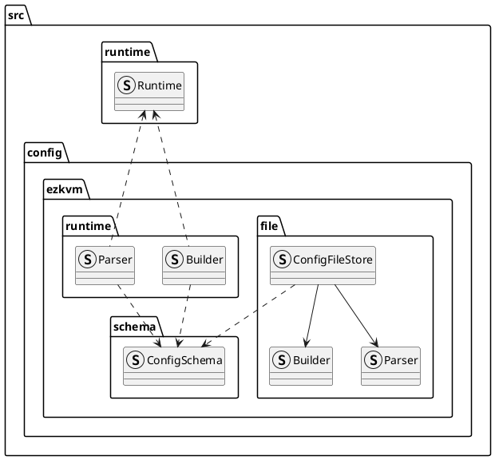

# Design

## Directories:
- file: This directory contains types specific for reading / writing Ezkvm config files as well as serializing/deserializing them. It should not depend on types related to runtime.
- schema: This directory contains Ezkvm config schema specific types, should not depend on types related to file io or runtime.
- runtime: This directory contains types specific for translating from Ezkvm schema to Runtime and vice versa.

## Design

