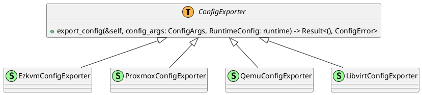

src/config_exporter/README.md

# Config Exporter

## Requirements
This document describes how the config exporter stage is modeled.

First some requirements:
1. Ezkvm needs to support multiple export formats, for now they consist of the following:
	1. ezkvm virtual machine config files (yaml)
	2. qemu command line
 2. Each exporter should take a ezkvm machine runtime model as input
 3. Each exporter is passed relevant command line args (any argument passed using the ```--export:type=<exporter>[,<args>]``` flag. Where ```<args>``` is a comma seperated list of arguments to be passed to the exporter.
 4. The exporters shall each implement the generic ConfigExporter trait, that defines how arguments are passed to the exporter, and how the runtime is passed. This trait shall be generic so that it does not depend on the actual implementation of the exporter, this to allow easy extensibility.
 5. Each implementation shall be in a separate subdirectory, the current directory shall only be used for generic types and traits that are shared by more than one implementation.

## Command line arguments

Export command line arguments will typically look like this:

```
--output:type=qemu,config=<name>.qemu.cmd
--output:type=ezkvm,config=<name>.yaml
```

## Design

### Importer trait

```
pub struct ConfigArgs {
	pub args: Vec<String>
}

pub trait ConfigExporter {
	type ConfigError;

	fn import_config(
		&self,
		config_args: ConfigArgs
	) -> Result<RuntimeConfig, Self::ConfigError>;
}
```

### Class Diagram


