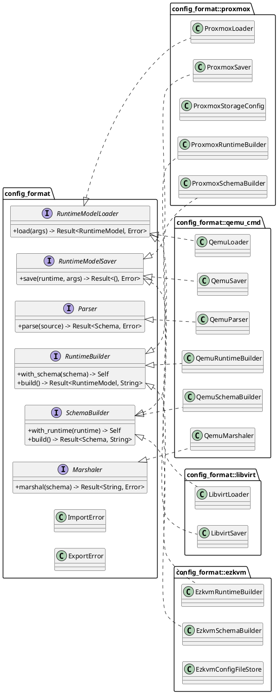
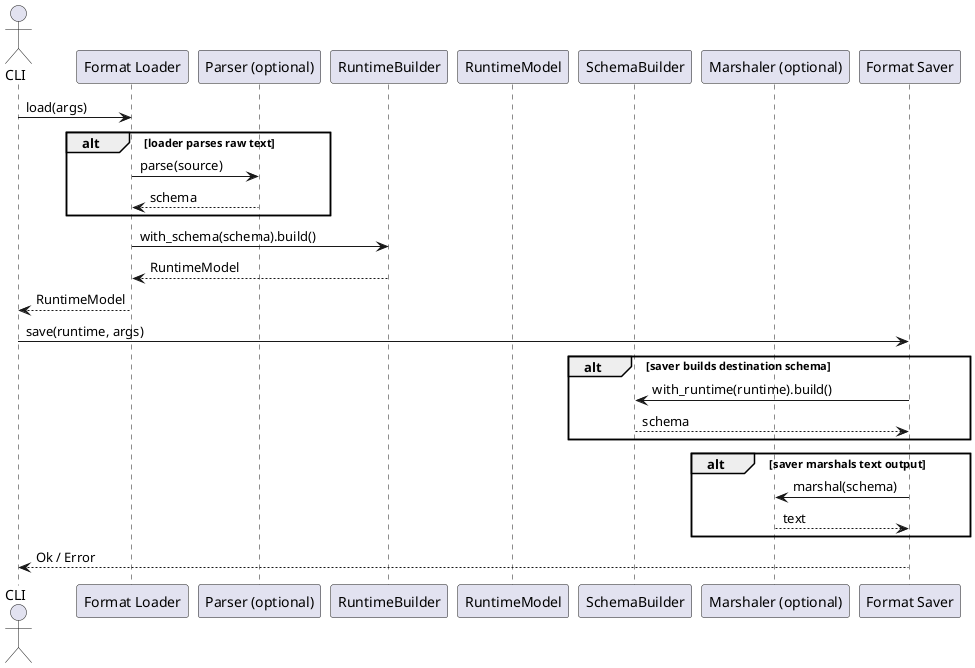

# Config Format Module

This module contains format adapters that translate external VM configuration representations into the canonical `RuntimeModel`, and back when supported.

## Current Architecture

The module is trait-driven and stage-oriented.

Core traits in `mod.rs`:

- `RuntimeModelLoader`
  - File/IO entrypoint for loading a format into `RuntimeModel`
- `RuntimeModelSaver`
  - File/IO entrypoint for saving a `RuntimeModel` to a format
- `Parser`
  - Text -> format schema
- `RuntimeBuilder`
  - format schema -> `RuntimeModel`
- `SchemaBuilder`
  - `RuntimeModel` -> format schema
- `Marshaler`
  - format schema -> text

This replaces the older importer/exporter/options dispatch model.

## Format Status (Current)

- `ezkvm`
  - `EzkvmRuntimeBuilder` and `EzkvmSchemaBuilder` are implemented
  - persistence helper: `EzkvmConfigFileStore`
- `proxmox`
  - runtime import path implemented (`ProxmoxLoader` + `ProxmoxRuntimeBuilder`)
  - runtime export path implemented (`ProxmoxSaver` + `ProxmoxSchemaBuilder`)
  - schema parser/renderer implemented (`ProxmoxConfigSchema`)
  - storage token/path resolver implemented (`ProxmoxStorageConfig`)
- `qemu_cmd`
  - parser, runtime builder, schema builder, marshaler, loader, and saver implemented
- `libvirt`
  - loader and saver exist, but both currently return unsupported errors

## Module Layout

```text
src/config_format/
|- mod.rs
|- README.md
|- parity_tests.rs
|- ezkvm/
|  |- mod.rs
|  |- schema.rs
|  |- runtime_builder.rs
|  |- schema_builder.rs
|  |- compact_yaml.rs
|  |- store.rs
|  `- README.md
|- proxmox/
|  |- mod.rs
|  |- storage_resolver.rs
|  |- runtime/
|  |  |- mod.rs
|  |  |- builder.rs
|  |  |- loader.rs
|  |  `- saver.rs
|  |- schema/
|  |  |- mod.rs
|  |  |- schema.rs
|  |  `- builder.rs
|  `- README.md
|- qemu_cmd/
|  |- mod.rs
|  |- schema.rs
|  |- parser.rs
|  |- runtime_builder.rs
|  |- schema_builder.rs
|  |- marshaler.rs
|  |- loader.rs
|  `- saver.rs
`- libvirt/
   |- mod.rs
   |- loader.rs
   |- saver.rs
   `- README.md
```

## Class Diagram (PlantUML)



## Conversion Sequence (PlantUML)



## Assumptions And Limitations

- The input fixture corpus under `input/` is treated as read-only reference material for parity and regression tests.
- Cross-format parity validation currently targets a supported semantic subset (identity, machine/chipset, CPU topology, memory sizing, UEFI presence, baseline storage/network counts, guest-agent flag).
- Parity tests do not require exact command-line text parity with Proxmox output ordering or every Proxmox-specific runtime literal.
- Host-gated startup smoke tests are optional (`#[ignore]`) and must be explicitly enabled with `EZKVM_ENABLE_HOST_START_SMOKE=1`.
- Host-gated startup smoke checks rely on host path preflight and call `RuntimeModel::start()`, which currently validates command assembly and emits the launch command rather than spawning QEMU.

## References

- `src/README.md`
- `src/config_format/ezkvm/README.md`
- `src/config_format/proxmox/README.md`
- `src/config_format/libvirt/README.md`
