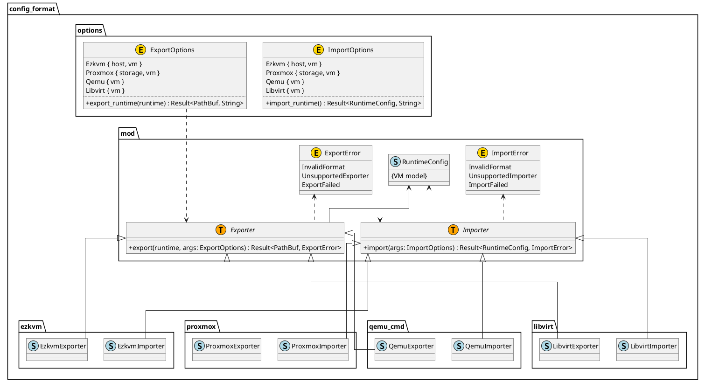
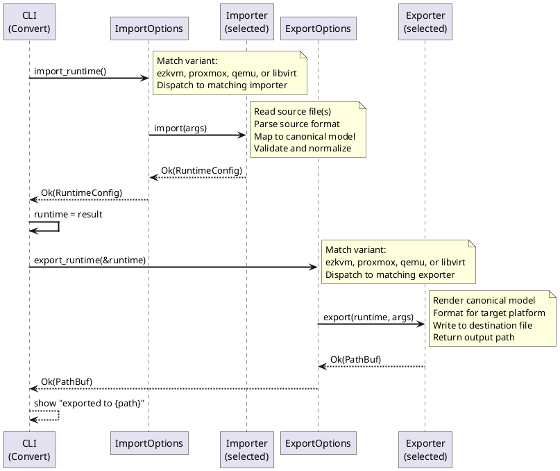

# Config Format Module

Provides importers and exporters that translate between external VM configuration formats (ezkvm YAML, Proxmox `.conf`, QEMU command-line, libvirt XML) and the canonical `RuntimeConfig` model used by the rest of the pipeline.

## Requirements

### Multiple Import Sources
- Import from **ezkvm** YAML format (host + VM config files)
- Import from **Proxmox** `.conf` format (with storage.cfg context)
- Import from **QEMU** command-line format or captured scripts
- Import from **libvirt** XML format
- Each importer normalizes source-specific semantics into canonical model terms

### Multiple Export Targets
- Export to **ezkvm** YAML format (host + VM config files)
- Export to **Proxmox** configuration format
- Export to **QEMU** command-line format (ordered, quoted arguments)
- Export to **libvirt** XML format
- Each exporter renders the canonical model into destination-specific syntax

### Normalized Canonical Model
- All importers produce the same `RuntimeConfig` type regardless of source
- Source-specific keys are mapped deterministically to canonical names (e.g., `cpu` → `cpu.model`, `machine` → `chipset`)
- Canonical model is source-agnostic and independent of any particular VM platform
- No source-specific fields leak into the canonical model

### Deterministic Format Translation
- Import phase: source config + import-host context → `RuntimeConfig`
- Export phase: `RuntimeConfig` + export-specific options → destination format
- For fixed input and options, output must be bit-identical (idempotent)
- Field ordering and text escaping must be canonical

### QEMU Command Coverage (Current)
- `qemu_cmd` importer/exporter are implemented with staged adapters (`parser`, `runtime_builder`, `schema_builder`, `marshaler`).
- Runtime import/export maps VM name, machine/chipset, CPU topology, memory, and common display/guest-agent/GPU patterns.
- Parser keeps full raw argv in schema so unsupported flags are preserved for parse/marshal roundtrips as passthrough arguments.
- Runtime conversion still leaves many source-specific flags unmapped; unsupported flags are not mapped into canonical runtime fields.

### Structural Validation
- Input files are validated for syntax and semantic consistency at import boundary
- Source-specific validation (e.g., required fields) occurs during import
- Schema violations produce structured errors with source location information when available
- Unsupported source fields warn (not fail) when conversion can proceed safely

---

# Design

## Type Overview

The config_format module provides two core trait abstractions and their implementations:

| Symbol | Kind | File | Role |
|---|---|---|---|
| `Importer` | Trait | `mod.rs` | Contract for any type that reads source format into `RuntimeConfig` |
| `Exporter` | Trait | `mod.rs` | Contract for any type that writes `RuntimeConfig` to destination format |
| `ImportOptions` | Enum | `options.rs` | Selects and configures an importer; dispatches `import_runtime()` |
| `ExportOptions` | Enum | `options.rs` | Selects and configures an exporter; dispatches `export_runtime()` |
| `EzkvmImporter` | Struct | `ezkvm/mod.rs` | Importer for ezkvm YAML format |
| `EzkvmExporter` | Struct | `ezkvm/mod.rs` | Exporter to ezkvm YAML format |
| `ProxmoxImporter` | Struct | `proxmox/mod.rs` | Importer for Proxmox `.conf` format |
| `ProxmoxExporter` | Struct | `proxmox/mod.rs` | Exporter to Proxmox configuration format |
| `QemuImporter` | Struct | `qemu_cmd/mod.rs` | Importer for QEMU command-line format |
| `QemuExporter` | Struct | `qemu_cmd/mod.rs` | Exporter to QEMU command-line format |
| `LibvirtImporter` | Struct | `libvirt/mod.rs` | Importer for libvirt XML format |
| `LibvirtExporter` | Struct | `libvirt/mod.rs` | Exporter to libvirt XML format |
| `RuntimeConfig` | Type | `runtime_config` | Canonical VM configuration model used by all importers/exporters |
| `ImportError` | Enum | `mod.rs` | Error types for import failures |
| `ExportError` | Enum | `mod.rs` | Error types for export failures |

---

## Class Diagram



---

## Import/Export Sequence



---

## Module Organization

```
src/config_format/
├── mod.rs                  # Core traits (Importer, Exporter) and top-level types
├── options.rs              # ImportOptions and ExportOptions enum dispatch
├── ezkvm/
│   ├── mod.rs
│   ├── importer.rs         # EzkvmImporter implementation
│   ├── exporter.rs         # EzkvmExporter implementation
│   └── diagnostics.rs      # Structured error reporting
├── proxmox/
│   ├── mod.rs
│   ├── importer.rs         # ProxmoxImporter implementation
│   └── exporter.rs         # ProxmoxExporter implementation
├── qemu_cmd/
│   ├── mod.rs
│   ├── importer.rs         # QemuImporter implementation
│   └── exporter.rs         # QemuExporter implementation
└── libvirt/
    ├── mod.rs
    ├── importer.rs         # LibvirtImporter implementation
    └── exporter.rs         # LibvirtExporter implementation
```

---

# References

- **CLI Entry Point**: [src/cli/README.md](../cli/README.md) – Command-line parsing and subcommand dispatch to importers/exporters
- **Model Separation Pipeline**: [doc/dev/architecture/model-separation-pipeline.md](../../doc/dev/architecture/model-separation-pipeline.md) – Design contract for import/export boundaries and stage validation expectations
- **Import Adapters Contract**: [doc/dev/architecture/import-adapters.md](../../doc/dev/architecture/import-adapters.md) – Specification for implementing new source-format adapters
- **Canonical Runtime Config**: [src/runtime_config/README.md](../runtime_config/README.md) – Structure and validation for the canonical VM model
- **VM Specification & Parsing**: [doc/dev/architecture/design/vm-spec-parsing-validation.md](../../doc/dev/architecture/design/vm-spec-parsing-validation.md) – Schema and validation rules for ezkvm YAML format
- **Proxmox Domain Knowledge**: [doc/dev/domain-knowledge/proxmox/](../../doc/dev/domain-knowledge/proxmox/) – Proxmox-to-canonical mapping reference and format details
- **Architecture Overview**: [src/README.md](../README.md) – High-level system requirements and command-line syntax