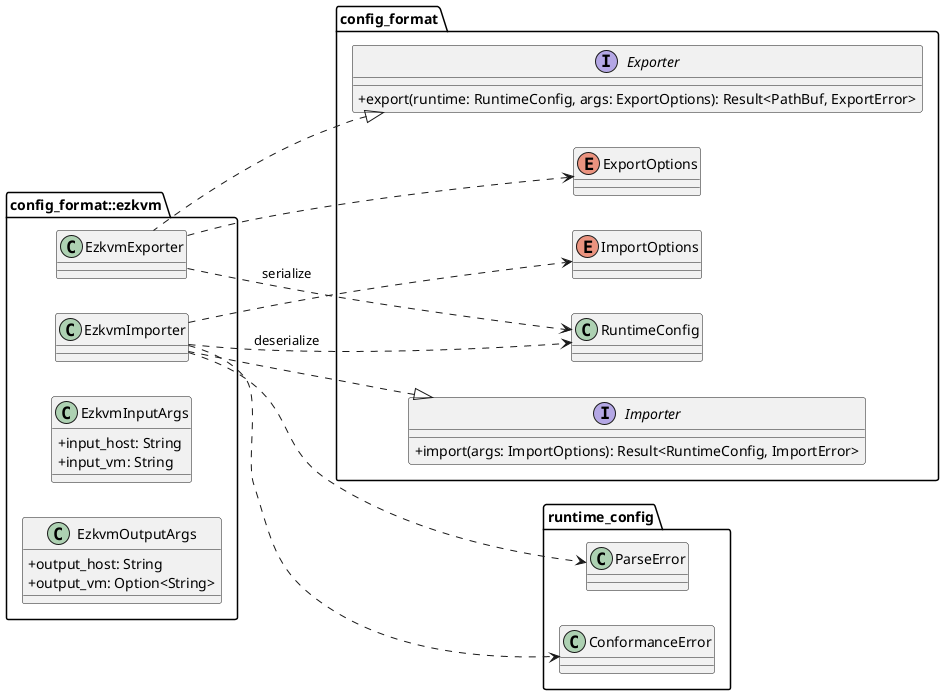
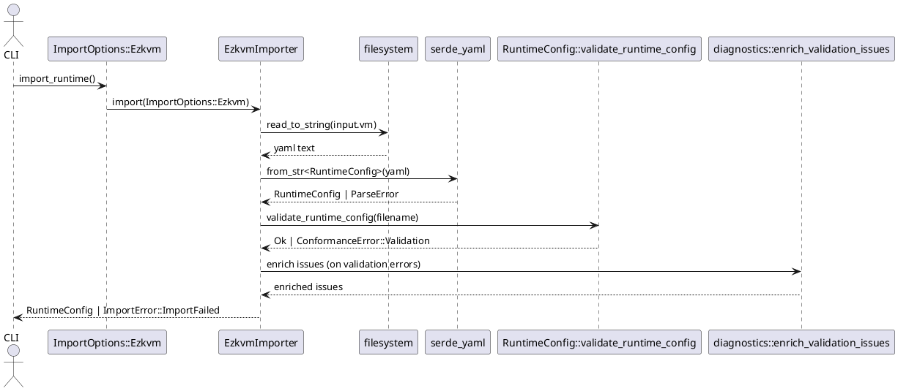
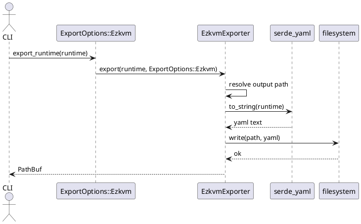

# Ezkvm Config Format

This module implements ezkvm YAML import/export at the config format boundary.

- Import path: ezkvm YAML -> `RuntimeConfig`
- Export path: `RuntimeConfig` -> ezkvm YAML

The importer and exporter both use the canonical runtime schema from `src/runtime_config/model.rs`.

## Files

- `importer.rs`: Parse and validate ezkvm YAML into `RuntimeConfig`.
- `exporter.rs`: Serialize `RuntimeConfig` back to YAML and write to disk.
- `diagnostics.rs`: Validation issue enrichment with source context.
- `mod.rs`: Module wiring, `EzkvmImporter`, `EzkvmExporter`, args re-exports.

## Ezkvm Runtime Schema

The ezkvm YAML schema is the canonical runtime schema represented by `RuntimeConfig`:

```yaml
metadata:
  schema_version: "1.0.0"
  vm_name: "win11-dev"
host:
  resources: []
virtual_machine:
  machine:
    family: "pc"
    chipset: "q35"
  memory:
    size: 8589934592
  devices: []
```

### Top-level structure

- `metadata`
  - `schema_version: String`
  - `vm_name: String`
- `host`
  - `display: Option<DisplaySchema>`
  - `audio: Option<AudioSchema>`
  - `resources: Vec<Resource>`
- `virtual_machine`
  - `machine: { family, chipset, version? }`
  - `cpu: Option<Cpu>`
  - `memory: Memory` (byte-based, with optional memory backend and NUMA settings)
  - `smbios_uuid: Option<String>`
  - `vmgenid: Option<String>`
  - `display: Option<Display>`
  - `audio: Option<Audio>`
  - `guest_agent: Option<GuestAgent>`
  - `devices: Vec<Device>` (includes GPU as PCI/PCIe devices; headless if omitted)

`virtual_machine.memory` fields:

- `size: usize` (required, bytes)
- `hugepages_kb: Option<usize>`
- `numa_enabled: bool` (defaults to `false`)

### Resource variants

`host.resources` is a keyed list (untagged enum wrappers):

- `{ storage: StorageResource }`
  - `{ file: <path> }`
  - `{ block_device: <path> }`
- `{ network: NetworkResource }`
  - `{ name: <logical-name>, tap: <host-tap-iface> }`
  - `{ name: <logical-name>, bridge: <host-bridge-iface> }`
- `{ pci_device: PciDeviceResource }`
- `{ pcie_device: PcieDeviceResource }`
- `{ usb_device: UsbDeviceResource }`

### Device variants

`virtual_machine.devices` is a keyed list (untagged enum wrappers):

- `{ pcie: { bus?, device?, function?, type } }`
- `{ pci: { bus?, address?, device } }`
- `{ usb: { bus?, address?, device } }`
- `{ sata: { bus?, address?, type } }`
- `{ ide: { bus?, address?, type } }`
- `{ scsi: { bus?, address?, device } }`

Where device-internal `type` fields are used, values are snake_case enum names
(for example `virtio_net`, `pv_scsi`, `passthrough`, `ssd`, `hdd`, `cdrom`).

For `pcie.type: passthrough`, the following fields are supported:

- `host: String` (required PCI BDF such as `0000:0e:11.6`)
- `id: Option<String>`
- `rombar: Option<bool>`
- `romfile: Option<String>`

## Importer Design

`EzkvmImporter::import` uses `ImportOptions::Ezkvm { host, vm }`.

Behavior:

1. Validate selected format is ezkvm (`InvalidFormat` otherwise).
2. Read VM YAML from `input.vm`.
3. Deserialize YAML into `RuntimeConfig` using `serde_yaml::from_str`.
4. Run runtime conformance validation via `validate_runtime_config(filename)`.
5. Enrich validation diagnostics (`diagnostics::enrich_validation_issues`) when needed.
6. Return validated `RuntimeConfig`.

Current validation highlights:

- Required non-empty strings:
  - `metadata.schema_version`
  - `metadata.vm_name`
  - `virtual_machine.machine.family`
  - `virtual_machine.machine.chipset`
- VM name must match filename stem.
- For `machine.family == "pc"`, chipset must be `q35` or `i440fx`.
- Storage/network resource reference checks are enforced for device types that carry `resource` ids.
- `gpu`, `display`, `audio`, and `guest_agent` are currently optional and pass through runtime model assembly when present.

## Exporter Design

`EzkvmExporter::export` uses `ExportOptions::Ezkvm { host, vm }`.

Behavior:

1. Validate selected format is ezkvm (`InvalidFormat` otherwise).
2. Resolve output path:
   - Use `output.vm` when provided.
   - Otherwise default to `<metadata.vm_name>.yaml`.
3. Serialize `RuntimeConfig` with `serde_yaml::to_string`.
4. Write YAML to destination path.
5. Return output path.

## Class Diagram (PlantUML)



## Import Sequence (PlantUML)



## Export Sequence (PlantUML)



## Notes

- `input.host` and `output.host` are currently parsed but not yet used by ezkvm importer/exporter internals.
- Import and export are intentionally centered on canonical `RuntimeConfig` to keep format adapters thin and deterministic.

## Minimal Valid YAML

Use this as a baseline document that passes parsing and runtime conformance checks:

```yaml
metadata:
  schema_version: "1.0.0"
  vm_name: "demo-vm"
virtual_machine:
  machine:
    family: "pc"
    chipset: "q35"
  memory:
    size: 8589934592
  devices: []
resources: []
```

If the file is named `demo-vm.yaml`, the importer validation path accepts this document.

## Common Valid YAML Example

This example is closer to a typical VM definition and includes:

- an explicit CPU model
- a SATA device entry
- a bridge-backed network resource
- a PCIe network controller entry
- optional display/audio/guest-agent settings
- GPU device defined in `virtual_machine.devices` as PCI/PCIe type

```yaml
metadata:
  schema_version: 1.0.0
  vm_name: workstation-01

host:
  resources:
    - network: { id: "net0", bridge: "br0" }
    - storage: { id: "disk0", block_device: "/dev/vm0/vm-108-disk0" }

virtual_machine:
  machine:
    family: pc
    chipset: q35
  cpu:
    model: Host
    cores: 8
    threads: 2
    sockets: 1
  memory:
    size: 17179869184
  gpu:
    type: virtio
  display:
    vnc:
      listen: 0.0.0.0
      port: 1
  audio:
    backend: pipe_wire
    controller: ich9_intel_hda
  guest_agent:
    enabled: true
  devices:
    - sata: { bus: 0, address: 0, type: ssd, resource: "disk0" }
    - pcie: { bus: 1, device: 7, function: 0, type: virtio_net, resource: "net0" }
```

Notes:

- `devices` and `resources` use keyed wrappers (for example `- sata: {...}` and `- network: {...}`).
- Some inner payload enums use `type: ...`; use snake_case values such as `virtio_net`.
- Unlike some draft examples, the current PCIe address shape uses `device` and `function` fields (not `address`).
- `resources[*].id` is used to resolve device references at runtime.
- SATA devices require `resource` and it must reference a storage resource id.
- IDE devices require `resource` and it must reference a storage resource id.
- PCIe `virtio_net` optionally accepts `resource`; when present it must reference a network resource id.
- Duplicate resource ids and missing device resource references are reported during conformance validation.
- `gpu.type` supports `standard`, `qxl`, `virtio`, `headless`, and `passthrough`.
- `display` supports `gtk`, `sdl`, `vnc`, `spice`, and `looking_glass` wrappers.
- `audio.backend` supports `none`, `alsa`, `pulse_audio`, and `pipe_wire`; `audio.controller` supports `ich9_intel_hda` and `ac97`.

Reference note for `dist/etc/ezkvm/vm.d/wakiza.yaml`:

- The current sample uses parser-compatible PCIe fields: `device`, `function`, and `type: virtio_net`.
- Device `resource` fields are now consumed by runtime resource resolution.
- Extra fields such as storage `format` still deserialize but are not yet used by runtime model construction.

## Common Invalid YAML Example

This example contains several common mistakes:

```yaml
metadata:
  schema_version: ""
  vm_name: "other-name"
virtual_machine:
  machine:
    family: "pc"
    chipset: "arm-virt"
  memory:
    size: "8589934592"
  devices: []
resources: []
```

Assuming the source filename is `demo-vm.yaml`, expected validation/parsing outcomes include:

- `metadata.schema_version`: required non-empty string violation
- `metadata.vm_name`: filename stem mismatch (`demo-vm` vs `other-name`)
- `virtual_machine.machine.chipset`: invalid value for `family: pc` (must be `q35` or `i440fx`)
- Parse error for `virtual_machine.memory.size`: `expected usize` (string value instead of integer)

Example human-readable validation report shape:

```text
Validation Report: 3 issue(s)

ERRORS (3):
  - metadata.schema_version: is required and must be a non-empty string
  - metadata.vm_name: must match filename stem 'demo-vm'
  - virtual_machine.machine.chipset: must be one of [q35, i440fx] when machine family is 'pc'
```

For type mismatches such as `memory.size: "8589934592"`, parsing fails before conformance issue aggregation and returns a YAML parse error containing the field path.
