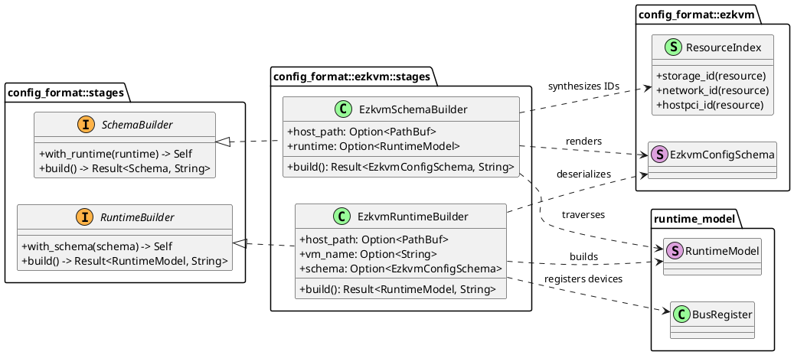
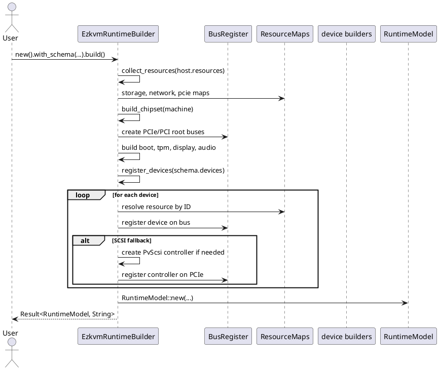
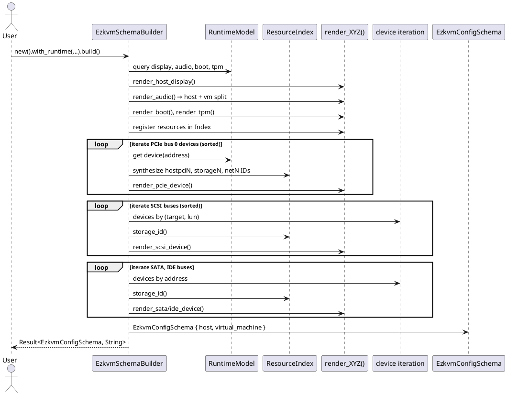

# Ezkvm Config Format

This module implements bidirectional conversion between ezkvm YAML configuration schema and the internal `RuntimeModel` abstraction.

## Architecture Overview

The ezkvm module provides a two-stage bidirectional transformation pipeline:

1. **Runtime Builder** (`stages/runtime_builder.rs`): `EzkvmConfigSchema` → `RuntimeModel`
   - Parses ezkvm schema and converts to runtime model representation
   - Resolves resources, builds chipset, registers devices across buses
   
2. **Schema Builder** (`stages/schema_builder.rs`): `RuntimeModel` → `EzkvmConfigSchema`
   - Converts runtime model representation back to ezkvm YAML schema
   - Synthesizes deterministic resource IDs
   - Maintains device ordering for consistent output

Both conversions preserve full semantic fidelity, enabling lossless round-trip transformations.

## Files

- `mod.rs`: Module root, `EzkvmConfigSchema` typedef, and stage builder exports
- `schema/`: YAML schema types, resource definitions, and model builders
- `stages/runtime_builder.rs`: Schema → RuntimeModel conversion with device registration logic
- `stages/schema_builder.rs`: RuntimeModel → Schema conversion with resource synthesis

## Schema Structure

The ezkvm YAML schema follows this structure:

```yaml
metadata:
  schema_version: "1.0.0"
  vm_name: "win11-dev"
host:
  display:
    vnc: { listen: "127.0.0.1", port: 5900 }
  audio:
    pulse_audio: {}
  resources:
    - storage: { file: "/path/to/disk.qcow2" }
    - network: { name: "eth0", bridge: "br0" }
    - pcie_device: { address: "0000:0e:11.6" }
virtual_machine:
  machine:
    family: "pc"
    chipset: "q35"
  cpu: { cores: 4 }
  memory: { size: 8589934592 }
  boot:
    order: "c"
    bios: { seabios: {} }
  devices:
    - pcie:
        bus: 0
        device: 0x10
        function: 0
        type: virtio_gpu
    - sata:
        bus: 0
        address: 0
        type: { ssd: { resource: "storage0" } }
    - scsi:
        bus: 0
        address: { target: 0, lun: 0 }
        device: { hdd: { resource: "storage1" } }
```

### Top-level structure

- **`metadata`**
  - `schema_version: String` — Schema version for compatibility tracking
  - `vm_name: String` — Virtual machine identifier
  
- **`host`**
  - `display: Option<DisplaySchema>` — Host display backend (VNC, Spice, GTK, SDL)
  - `audio: Option<AudioSchema>` — Host audio backend (ALSA, PulseAudio, PipeWire)
  - `resources: Vec<Resource>` — Keyed resource list (storage, network, PCIe, USB)

- **`virtual_machine`**
  - `machine: Machine` — `{ family: "pc", chipset: "q35"|"i440fx", version?: String }`
  - `cpu: Option<Cpu>` — CPU model and topology
  - `memory: Memory` — Byte-sized memory with optional NUMA and hugepage configuration
  - `boot: Boot` — Boot order and BIOS/UEFI configuration
  - `smbios_uuid: Option<String>` — System UUID
  - `vmgenid: Option<String>` — VM generation ID for guest OS detection
  - `tpm: Option<Tpm>` — Trusted Platform Module (emulated via swtpm)
  - `display: Option<Display>` — VM-side display (distinct from host display)
  - `audio: Option<Audio>` — VM-side audio controller
  - `guest_agent: Option<GuestAgent>` — QEMU Guest Agent configuration
  - `devices: Vec<Device>` — Virtual devices (PCIe, PCI, USB, SATA, IDE, SCSI)

### Memory configuration

- `size: usize` (required, bytes)
- `hugepages_kb: Option<usize>` (huge page size if enabled)
- `numa_enabled: bool` (defaults to `false`)

### Resource variants

`host.resources` contains keyed resource entries:

- **Storage**: `{ storage: StorageResource }`
  - `{ file: "<path>" }` — File-backed storage
  - `{ block_device: "<path>" }` — Block device storage

- **Network**: `{ network: NetworkResource }`
  - `{ name: "<logical-name>", tap: "<host-tap-iface>" }` — TAP interface
  - `{ name: "<logical-name>", bridge: "<host-bridge-iface>" }` — Bridge interface

- **PCIe Device**: `{ pcie_device: PcieDeviceResource }`
  - `{ address: "<pci-bdf>" }` — Host PCI BDF (e.g., `0000:0e:11.6`)
  - Resolved to `hostpciN` IDs during schema rendering

- **PCI Device**: `{ pci_device: PciDeviceResource }`

- **USB Device**: `{ usb_device: UsbDeviceResource }`

### Device variants

`virtual_machine.devices` contains entries for each attached device:

- **PCIe**: `{ pcie: { bus?, device?, function?, type } }`
  - Supports: `virtio_gpu`, `virtio_net`, `pv_scsi`, `passthrough`, `passthrough_gpu`, `ich9_intel_hda`, `ivshmem_plain`, `standard_gpu`
  - Passthrough devices can specify: `host`, `id`, `rombar`, `romfile`

- **PCI**: `{ pci: { bus?, address?, device } }`

- **USB**: `{ usb: { bus?, address?, device } }`

- **SATA**: `{ sata: { bus?, address?, type } }`
  - Types: `{ ssd: { resource } }`, `{ hdd: { resource } }`, `{ cdrom: { resource } }`

- **IDE**: `{ ide: { bus?, address?, type } }`
  - Types: `{ ssd: { resource } }`, `{ hdd: { resource } }`, `{ cdrom: { resource } }`

- **SCSI**: `{ scsi: { bus?, address?, device } }`
  - Address: `{ target, lun }`
  - Types: `{ ssd: { resource } }`, `{ hdd: { resource } }`, `{ cdrom: { resource } }`

## Conversion Flow

### Schema → RuntimeModel (Runtime Builder)

1. **Resource Resolution**: Resources are collected into type-specific maps (`ResourceMaps`) for O(1) lookup during device registration
2. **Chipset Initialization**: Chipset (q35 or i440fx) creates primary PCIe/PCI root buses via `BusRegister`
3. **Core Model Assembly**: CPU, memory, boot, TPM, display, audio, guest agent are built in isolation
4. **Device Registration**:
   - Each device type (PCIe, SATA, IDE, SCSI, USB, PCI) is resolved to its target bus
   - Device resources are resolved via `ResourceMaps` to obtain actual storage/network/host objects
   - **SCSI Special Case**: If a SCSI device references a bus without a controller, a PvScsi controller is dynamically created, registered on PCIe bus 0, and cached for subsequent devices on that SCSI bus

### RuntimeModel → Schema (Schema Builder)

1. **Resource Synthesis**: As devices are traversed, their runtime resources are synthesized into `hostpciN`, `storageN`, `netN` IDs via `ResourceIndex`
   - Each unique resource hashes to a deterministic ID
   - IDs are memoized to ensure identical resources reuse the same ID within a single render pass
   
2. **Deterministic Device Ordering**:
   - PCIe devices: sorted by `(device, function)` address components
   - SCSI/SATA/IDE buses: sorted by bus ID, then by device address
   - This ensures consistent YAML output across multiple render passes

3. **Host/VM Display Split**: Display configurations are routed to either `host.display` (remote access) or `virtual_machine.display` (VM-internal) depending on display type
   - Ich9IntelHda audio controllers are split similarly

## Key Patterns

### Resource Binding

Resources appear in both `host.resources` (keyed by synthesized ID) and device references (via `resource: "storageN"` markers). This dual-reference pattern allows:
- Safe resource sharing across devices
- Deterministic ID synthesis across render passes
- Schema validation against resource availability

### Bus Registration

Each bus type has a registry (`BusRegister`) that tracks controllers and devices:
- PCIe buses: supports passthrough devices, GPU devices, PvScsi controllers
- SATA/IDE/SCSI buses: support storage devices
- USB buses: support USB devices

Fallback bus creation (e.g., for SCSI) happens on-demand during device registration if no controller exists.

Behavior:

1. Validate selected format is ezkvm (`InvalidFormat` otherwise).
2. Read VM YAML from `input.vm`.
3. Deserialize YAML into `RuntimeConfig` using `serde_yaml::from_str`.
4. Run runtime conformance validation via `validate_runtime_config(filename)`.
5. Enrich validation diagnostics (`diagnostics::enrich_validation_issues`) when needed.
6. Return validated `RuntimeConfig`.

Current validation highlights:

- Required non-empty strings:
  - `metadata.schema_version`
  - `metadata.vm_name`
  - `virtual_machine.machine.family`
  - `virtual_machine.machine.chipset`
- VM name must match filename stem.
- For `machine.family == "pc"`, chipset must be `q35` or `i440fx`.
- Storage/network resource reference checks are enforced for device types that carry `resource` ids.
- `gpu`, `display`, `audio`, and `guest_agent` are currently optional and pass through runtime model assembly when present.

## Exporter Design

`EzkvmExporter::export` uses `ExportOptions::Ezkvm { host, vm }`.

Behavior:

1. Validate selected format is ezkvm (`InvalidFormat` otherwise).
2. Resolve output path:
   - Use `output.vm` when provided.
   - Otherwise default to `<metadata.vm_name>.yaml`.
3. Serialize `RuntimeConfig` with `serde_yaml::to_string`.
4. Write YAML to destination path.
5. Return output path.

## Stage Builder Architecture (PlantUML)



## Schema → RuntimeModel Conversion (PlantUML)



## RuntimeModel → Schema Conversion (PlantUML)



## Resource Synthesis Pattern (PlantUML)

```plantuml
@startuml
entity "RuntimeModel Device" as Device
control "ResourceIndex" as Index
collection "Render Context" as Context
database "YAML Output" as YAML

Device -> Index : render_devices(runtime)
Note over Index: storage_id(StorageResource)
Note over Index: Serialize resource to JSON
Note over Index: Check memoization map
alt Resource exists
  Index --> Device : return "storageN"
else New resource
  Index -> Context : push Resource::Storage {id, storage}
  Index -> YAML : add to host.resources[]
  Index --> Device : return "storageN"
end
Device -> YAML : reference resource via "storageN"
Note over YAML: Deterministic IDs across passes
@enduml
```

## Key Design Patterns

**Deterministic Device Ordering**: Devices are emitted in sorted order (PCIe by device/function; SATA/IDE/SCSI by bus ID then address) to ensure identical YAML output across rendering passes. This enables diffing and content-addressed caching.

**SCSI Fallback Controller Creation**: When a SCSI device references a bus with no controller, the builder creates a PvScsi controller on-demand, registers it on PCIe bus 0, and caches it for subsequent devices on the same bus. This ensures implicit controller creation doesn't conflict with explicit declarations.

**Dual-Reference Resource Binding**: 
- **Import (RuntimeBuilder)**: Resources in `host.resources[]` are collected into type-specific maps for O(1) device lookup during registration
- **Export (SchemaBuilder)**: Resources are synthesized on-the-fly via `ResourceIndex`, memoized to ensure deterministic ID synthesis (`storage0`, `net0`, `hostpci0`) across multiple render passes of the same runtime model

## Minimal Valid YAML

Use this as a baseline document that passes parsing and runtime conformance checks:

```yaml
metadata:
  schema_version: "1.0.0"
  vm_name: "demo-vm"
virtual_machine:
  machine:
    family: "pc"
    chipset: "q35"
  memory:
    size: 8589934592
  devices: []
resources: []
```

If the file is named `demo-vm.yaml`, the importer validation path accepts this document.

## Common Valid YAML Example

This example is closer to a typical VM definition and includes:

- an explicit CPU model
- a SATA device entry
- a bridge-backed network resource
- a PCIe network controller entry
- optional display/audio/guest-agent settings
- GPU device defined in `virtual_machine.devices` as PCI/PCIe type

```yaml
metadata:
  schema_version: 1.0.0
  vm_name: workstation-01

host:
  resources:
    - network: { id: "net0", bridge: "br0" }
    - storage: { id: "disk0", block_device: "/dev/vm0/vm-108-disk0" }

virtual_machine:
  machine:
    family: pc
    chipset: q35
  cpu:
    model: Host
    cores: 8
    threads: 2
    sockets: 1
  memory:
    size: 17179869184
  gpu:
    type: virtio
  display:
    vnc:
      listen: 0.0.0.0
      port: 1
  audio:
    backend: pipe_wire
    controller: ich9_intel_hda
  guest_agent:
    enabled: true
  devices:
    - sata: { bus: 0, address: 0, type: ssd, resource: "disk0" }
    - pcie: { bus: 1, device: 7, function: 0, type: virtio_net, resource: "net0" }
```

Notes:

- `devices` and `resources` use keyed wrappers (for example `- sata: {...}` and `- network: {...}`).
- Some inner payload enums use `type: ...`; use snake_case values such as `virtio_net`.
- Unlike some draft examples, the current PCIe address shape uses `device` and `function` fields (not `address`).
- `resources[*].id` is used to resolve device references at runtime.
- SATA devices require `resource` and it must reference a storage resource id.
- IDE devices require `resource` and it must reference a storage resource id.
- PCIe `virtio_net` optionally accepts `resource`; when present it must reference a network resource id.
- Duplicate resource ids and missing device resource references are reported during conformance validation.
- `gpu.type` supports `standard`, `qxl`, `virtio`, `headless`, and `passthrough`.
- `display` supports `gtk`, `sdl`, `vnc`, `spice`, and `looking_glass` wrappers.
- `audio.backend` supports `none`, `alsa`, `pulse_audio`, and `pipe_wire`; `audio.controller` supports `ich9_intel_hda` and `ac97`.

Reference note for `dist/etc/ezkvm/vm.d/wakiza.yaml`:

- The current sample uses parser-compatible PCIe fields: `device`, `function`, and `type: virtio_net`.
- Device `resource` fields are now consumed by runtime resource resolution.
- Extra fields such as storage `format` still deserialize but are not yet used by runtime model construction.

## Common Invalid YAML Example

This example contains several common mistakes:

```yaml
metadata:
  schema_version: ""
  vm_name: "other-name"
virtual_machine:
  machine:
    family: "pc"
    chipset: "arm-virt"
  memory:
    size: "8589934592"
  devices: []
resources: []
```

Assuming the source filename is `demo-vm.yaml`, expected validation/parsing outcomes include:

- `metadata.schema_version`: required non-empty string violation
- `metadata.vm_name`: filename stem mismatch (`demo-vm` vs `other-name`)
- `virtual_machine.machine.chipset`: invalid value for `family: pc` (must be `q35` or `i440fx`)
- Parse error for `virtual_machine.memory.size`: `expected usize` (string value instead of integer)

Example human-readable validation report shape:

```text
Validation Report: 3 issue(s)

ERRORS (3):
  - metadata.schema_version: is required and must be a non-empty string
  - metadata.vm_name: must match filename stem 'demo-vm'
  - virtual_machine.machine.chipset: must be one of [q35, i440fx] when machine family is 'pc'
```

For type mismatches such as `memory.size: "8589934592"`, parsing fails before conformance issue aggregation and returns a YAML parse error containing the field path.
