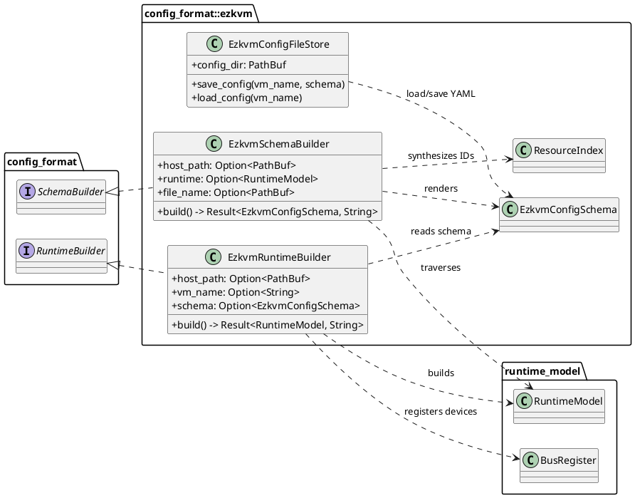
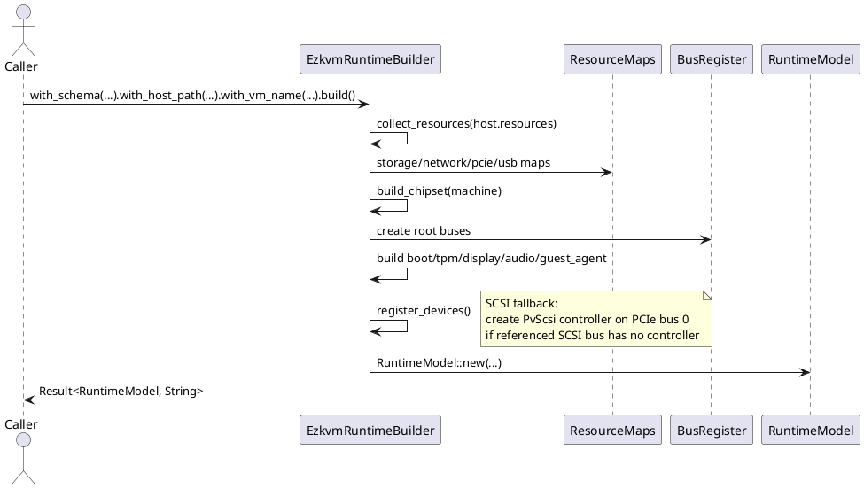
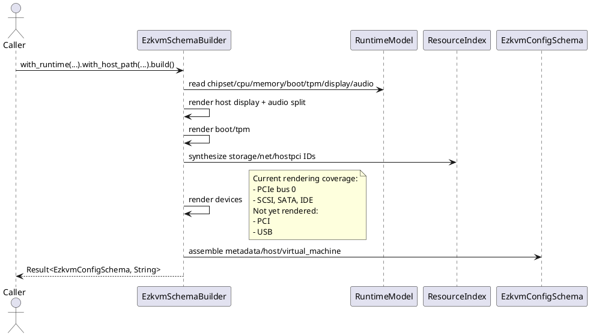

# Ezkvm Config Format

This module implements the ezkvm-side schema and conversion stages used by the config pipeline.

Current scope:

- YAML schema types for ezkvm VM config files (`EzkvmConfigSchema`)
- Schema -> runtime conversion (`EzkvmRuntimeBuilder`)
- Runtime -> schema conversion (`EzkvmSchemaBuilder`)
- File persistence helpers for `<vm>.yaml` (`EzkvmConfigFileStore`)
- Compact/styled YAML emission for saved configs

## Current File Layout

- `mod.rs`
  - Module wiring and public re-exports
- `schema.rs`
  - `EzkvmConfigSchema`, top-level schema structs/enums, constants
- `runtime_builder.rs`
  - `EzkvmRuntimeBuilder`, schema -> `RuntimeModel`
- `schema_builder.rs`
  - `EzkvmSchemaBuilder`, `RuntimeModel` -> schema
- `store.rs`
  - Read/write `<vm>.yaml` files from a config directory
- `compact_yaml.rs`
  - Styled YAML rendering used by `store.save_config`

## Schema Shape (Current)

`EzkvmConfigSchema` has three required top-level sections:

```yaml
metadata:
  schema_version: "1.0.0"
  vm_name: "demo-vm"
host:
  resources: []
virtual_machine:
  machine:
    family: "pc"
    chipset: "q35"
  memory:
    size: 8589934592
  devices: []
```

Important notes:

- `host` is required, even when only `resources: []` is present.
- `virtual_machine.boot` defaults to SeaBIOS when omitted.
- `virtual_machine.cpu` is optional in schema.
- `host.display` and `host.audio` are flattened optional enums.
- `virtual_machine.display` and `virtual_machine.audio` are separate VM-side fields.
- Display schemas preserve additional transport details when present:
  - VNC can carry a UNIX socket path, password flag, and GL-enabled rendering hint.
  - SPICE can carry TLS port/cipher settings, seamless migration, and a GL-enabled rendering hint.
  - `egl_headless` is represented as a distinct display schema variant for QEMU GL-headless rendering.

## Resources and Devices

`host.resources` uses `runtime_model::Resource` variants:

- Storage: `storage` (`file` or `block_device`)
- Network: `network` (`tap` or `bridge`)
- PCI passthrough resource: `pcie` (accepts `pcie_device` alias while reading)
- PCI resource: `pci_device`
- USB resource: `usb_device`

`virtual_machine.devices` supports:

- `pcie`
- `pci`
- `usb`
- `sata`
- `ide`
- `scsi`

## Conversion: Schema -> Runtime

`EzkvmRuntimeBuilder` requires:

- `host_path` (currently required as context)
- `vm_name`
- `schema`

Build flow:

1. Collect host resources into typed hash maps for fast lookup.
2. Create chipset (`q35` or `i440fx`) and root buses via `BusRegister`.
3. Build core runtime fields: CPU, memory, boot, TPM, display, audio, guest-agent.
4. Register devices onto target buses.
5. Return assembled `RuntimeModel`.

Behavior details:

- Display selection prefers `virtual_machine.display`; falls back to `host.display`.
- `host.display.looking_glass` is intentionally not converted into runtime display.
- Audio is read from `virtual_machine.audio` only.
- SCSI fallback is implemented:
  - if a SCSI bus is referenced without an existing controller,
  - a `PvScsiController` is created and registered on PCIe bus `0`.
- PCIe passthrough accepts either:
  - explicit `host` address in device config, or
  - `resource` id that resolves to a host PCIe resource.

## Conversion: Runtime -> Schema

`EzkvmSchemaBuilder` requires:

- `host_path` (currently required as context)
- `runtime`

Build flow:

1. Render metadata and machine descriptor.
2. Render host display/audio and VM audio split.
3. Render boot and TPM, synthesizing storage resource IDs as needed.
4. Traverse runtime buses and render supported device classes.
5. Build `host.resources` from synthesized deterministic IDs.

Resource synthesis uses an internal `ResourceIndex`:

- storage -> `storage0`, `storage1`, ...
- network -> `net0`, `net1`, ...
- host PCIe passthrough -> `hostpci0`, `hostpci1`, ...

IDs are memoized by serialized resource value so identical resources reuse the same id during a render pass.

## Current Fidelity and Known One-Way Areas

The module is reliable for the currently rendered subset, but it is not fully lossless for every runtime shape.

Notable current behavior:

- Runtime -> schema currently renders:
  - PCIe devices from bus `0`
  - SCSI, SATA, IDE devices
- Runtime -> schema currently does not render:
  - PCI devices
  - USB devices
- Runtime -> schema renders `virtual_machine.display` when the runtime display is representable, including richer VNC/SPICE transport fields and `egl_headless`.
- Runtime display is rendered into `host.display`; `LookingGlass` display returns an error because host schema cannot represent it here.
- Import path treats missing `virtual_machine.cpu` as default CPU; exporting then emits a concrete CPU value.

## File Store Behavior

`EzkvmConfigFileStore` reads/writes `<vm_name>.yaml` under a configured directory.

- Save path: `<config_dir>/<vm_name>.yaml`
- Save encoding: styled compact YAML (`to_styled_compact_yaml`)
- Load path: same file, deserialized via `EzkvmConfigSchema::from_str`

## Diagrams (Updated)

### Module Structure (PlantUML)



### Schema -> Runtime Sequence (PlantUML)



### Runtime -> Schema Sequence (PlantUML)



## Minimal Valid YAML Example

The following is the smallest practical shape that matches required fields:

```yaml
metadata:
  schema_version: "1.0.0"
  vm_name: "demo-vm"
host:
  resources: []
virtual_machine:
  machine:
    family: "pc"
    chipset: "q35"
  memory:
    size: 8589934592
  devices: []
```
