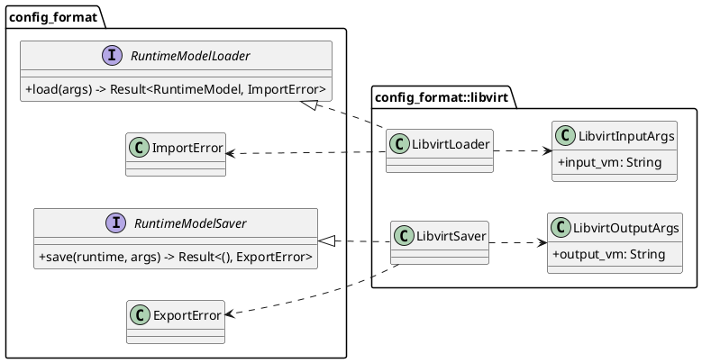
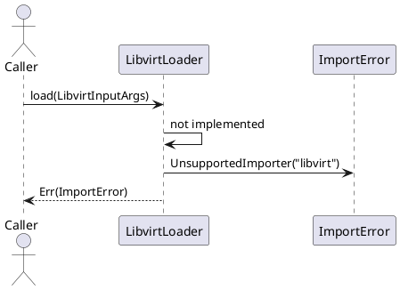
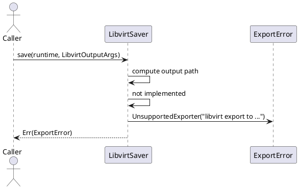

# Libvirt Config Format

This module provides the libvirt adapter boundary for the config format pipeline.

Current implementation status:

- input argument model is defined
- output argument model is defined
- loader and saver structs are present
- actual runtime mapping is not implemented yet

## Current File Layout

- `mod.rs`
  - module wiring and public re-exports
- `loader.rs`
  - `LibvirtInputArgs` and `LibvirtLoader`
- `saver.rs`
  - `LibvirtOutputArgs` and `LibvirtSaver`

## Loader

`LibvirtLoader` implements `RuntimeModelLoader` with:

- `Args = LibvirtInputArgs`
- `Error = ImportError`

`LibvirtInputArgs` currently expects:

- `input.vm` -> path to the libvirt XML file

Current behavior:

- `load(...)` always returns:
  - `ImportError::UnsupportedImporter("libvirt")`

## Saver

`LibvirtSaver` implements `RuntimeModelSaver` with:

- `Args = LibvirtOutputArgs`
- `Error = ExportError`

`LibvirtOutputArgs` currently expects:

- `output.vm` -> destination file path

Current behavior:

- `save(...)` currently returns:
  - `ExportError::UnsupportedExporter(...)`
- error includes requested destination path in the message

## Class Diagram (PlantUML)

## Load Sequence (PlantUML)

## Save Sequence (PlantUML)

## Implementation Notes

When libvirt mapping work starts, this module should grow with the same staged shape used elsewhere:

- parser (XML -> schema)
- runtime builder (schema -> runtime)
- schema builder (runtime -> schema)
- marshaler (schema -> XML)

Until then, callers should treat libvirt mode as explicitly unsupported at runtime.
