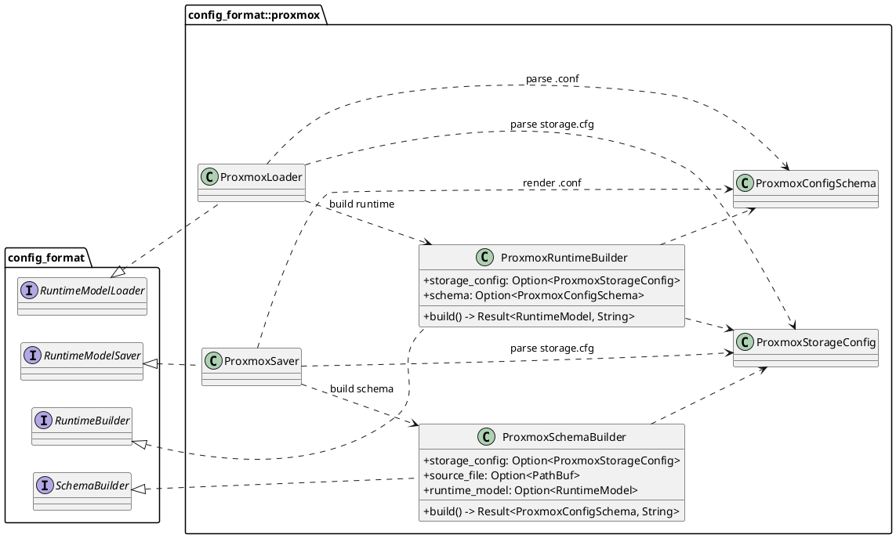
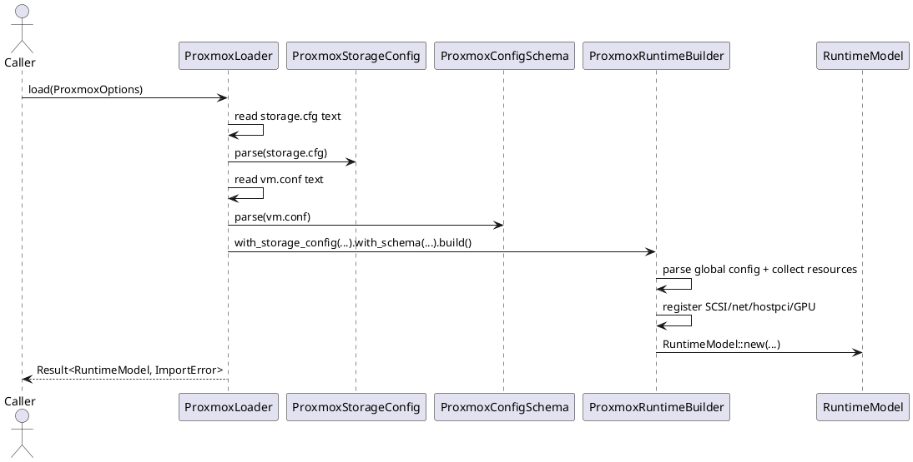
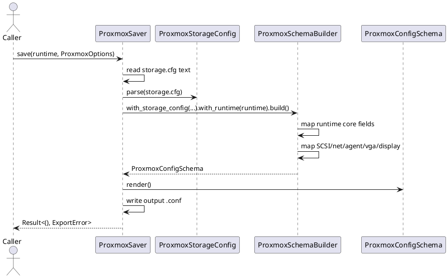

# Proxmox Config Format

This module contains the Proxmox adapter implementation for the config format pipeline.

It covers four concerns:

- Proxmox `.conf` schema parsing and rendering
- Proxmox schema -> `RuntimeModel` mapping
- `RuntimeModel` -> Proxmox schema mapping
- `storage.cfg` token/path resolution

## Current File Layout

- `mod.rs`
  - module wiring and public re-exports
- `storage_resolver.rs`
  - `ProxmoxStorageConfig` parser and token/path resolver
- `runtime/mod.rs`
  - runtime stage module root
- `runtime/builder.rs`
  - `ProxmoxRuntimeBuilder` (`ProxmoxConfigSchema` -> `RuntimeModel`)
- `runtime/loader.rs`
  - `ProxmoxLoader` file IO (`storage.cfg` + `.conf` -> runtime)
- `runtime/saver.rs`
  - `ProxmoxSaver` file IO (`RuntimeModel` -> `.conf`)
- `schema/mod.rs`
  - schema stage module root
- `schema/schema.rs`
  - `ProxmoxConfigSchema`, parser, renderer, parse error model
- `schema/builder.rs`
  - `ProxmoxSchemaBuilder` (`RuntimeModel` -> `ProxmoxConfigSchema`)

## Schema Layer

`ProxmoxConfigSchema` contains:

- `global: ProxmoxSection`
- `snapshots: BTreeMap<String, ProxmoxSection>`

`ProxmoxSection.entries` is a `BTreeMap<String, ProxmoxValue>` where `ProxmoxValue` is:

- `Scalar { value }`
- `Compound { head, options[] }`

Current parser guarantees:

- ignores blank lines and comments
- supports snapshot blocks (`[snapshot_name]`)
- rejects duplicate keys in one section
- rejects duplicate snapshot headers
- preserves deterministic render order through `BTreeMap`

## Runtime Import Path

`ProxmoxLoader` and `ProxmoxRuntimeBuilder` implement the import path.

`ProxmoxLoader` flow:

1. Read `storage.cfg`.
2. Parse `ProxmoxStorageConfig`.
3. Read source `.conf`.
4. Parse `ProxmoxConfigSchema`.
5. Build runtime via `ProxmoxRuntimeBuilder`.

`ProxmoxRuntimeBuilder` maps:

- core identity and topology: `name`, `machine`, `memory`, `cpu`, `cores`, `sockets`
- memory policy: `hugepages`, `numa`
- guest features: `agent`, `smbios1` uuid, `vmgenid`
- display: `spice` and implicit display when `vga=qxl`
- boot firmware: `bios=ovmf` with optional `efidisk0`
- TPM state storage if `tpmstate0` exists
- storage devices from `scsiN`
- network devices from `netN`
- passthrough devices from `hostpciN`
- GPU selection from `vga`

Notable runtime registration behavior:

- SCSI devices trigger PvScsi controller creation on PCIe bus `0`.
- Virtio net devices are placed on PCIe bus `0` with preferred addresses starting at `0x10`.
- Host PCI passthrough devices are registered as PCIe passthrough devices.

## Runtime Export Path

`ProxmoxSaver` and `ProxmoxSchemaBuilder` implement the export path.

`ProxmoxSaver` flow:

1. Read and parse `storage.cfg`.
2. Build `ProxmoxConfigSchema` from runtime via `ProxmoxSchemaBuilder`.
3. Render deterministic `.conf` text with `schema.render()`.
4. Write output file.

`ProxmoxSchemaBuilder` supports two entry modes:

- runtime mode (`with_runtime`) for normal export
- source file mode (`with_source_file`) to parse an existing Proxmox config into schema

Current runtime -> schema field coverage:

- always rendered:
  - `name`, `machine`, `memory`, `cpu`, `cores`, `sockets`
- conditionally rendered:
  - `bios`, `efidisk0` for UEFI
  - `scsiN` from runtime SCSI devices
  - `netN` from runtime PCIe virtio-net devices
  - `agent`
  - `vga`
  - `spice` or `vnc`

Current known gaps:

- TPM is not mapped in runtime -> schema builder.
- snapshot sections are not generated by runtime -> schema path.

## Storage Resolver

`ProxmoxStorageConfig` parses a subset of `storage.cfg` for:

- `dir`
- `lvm`
- `lvmthin`

Supported conversions:

- token -> resource (`token_to_resource`)
  - absolute paths map to file resources
  - `<storage_id>:<volume>` resolves using `storage.cfg`
- resource -> token (`resource_to_token`)
  - maps file and block-device resources back to storage tokens when possible
  - falls back to absolute path text when no mapping exists

## Assumptions And Limitations

- Proxmox import/export currently focuses on the shared supported subset used by runtime parity tests rather than full Proxmox command-line equivalence.
- `storage.cfg` presence is required for runtime import and export paths because token-to-path and path-to-token conversion depends on it.
- Runtime import reads only the global Proxmox section for active VM configuration; snapshot sections are parsed by schema but not materialized as runtime variants.
- Runtime export does not currently reconstruct TPM config fields from runtime into Proxmox schema.
- Runtime export does not currently emit snapshot sections from runtime state.
- Some Proxmox runtime literals remain intentionally out of scope in current mapping (for example full lifecycle/QMP daemonization and advanced blockdev layering parity).

## Class Diagram (PlantUML)

## Import Sequence (PlantUML)

## Export Sequence (PlantUML)

