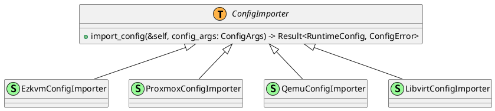

# Config Importer Stage

## Requirements
This document describes how the config importer stage is modeled.

First some requirements:
1. Ezkvm needs to support multiple import formats, for now they consist of the following:
	1. ezkvm virtual machine config files (yaml)
	2. proxmox config files
	3. qemu command line
	4. libvirt config files
 2. Each importer should return a generic ezkvm machine runtime model
 3. Each importer is passed relevant command line args (any argument passed following a --<importer_type> argument, where <importer_type> is a unique identifier for the importer, for the above mentioned importers, this could be --ezkvm, --proxmox, --qemu, --libvirt)
 4. The importers shall each implement the generic ConfigImporter trait, that defines how arguments are passed to the importer, and how the resulting runtime is returned. This trait shall be generic so that it does not depend on the actual implementation of the importer, this to allow easy extensibility.
 5. Each implementation shall be in a separate subdirectory, the current directory shall only be used for generic types and traits that are shared by more than one implementation.

## Command line arguments

Import command line will typically look like this:

```
ezkvm import --ezkvm <filename> --profiles=/etc/ezkvm/profiles.d
ezkvm import --proxmox <filename> --storage=/etc/pve/storage.cfg
ezkvm import --qemu <filename>
ezkvm import --libvirt <filename>
```

## Design

### Importer trait

```
pub struct ConfigArgs {
	pub args: Vec<String>
}

pub trait ConfigImporter {
	type ConfigError;

	fn import_config(
		&self,
		config_args: ConfigArgs
	) -> Result<RuntimeConfig, Self::ConfigError>;
}
```

### Class Diagram


