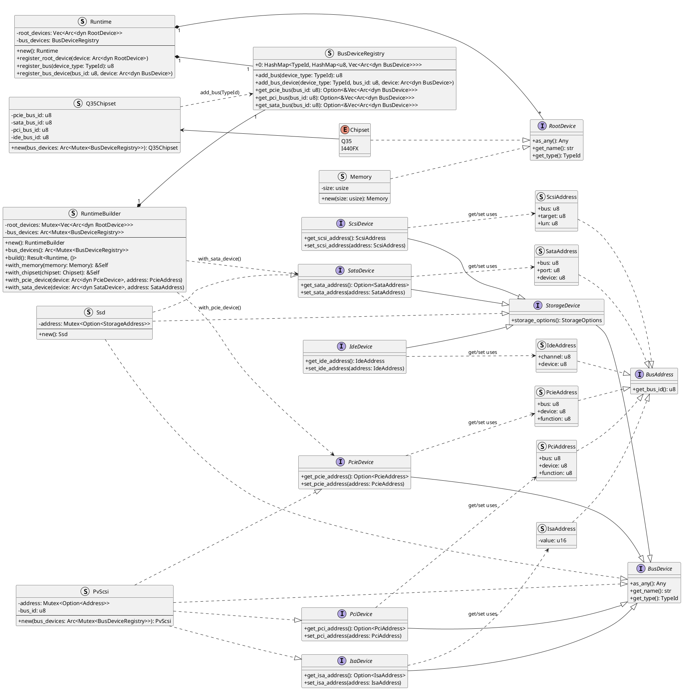
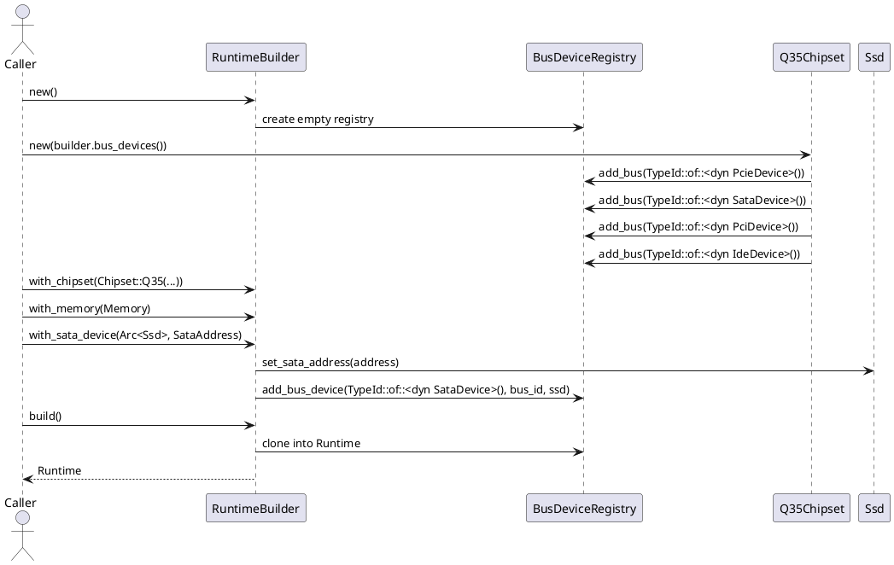

# Runtime Module Design Notes

This directory models a VM runtime device graph with explicit bus/address abstractions.
The code uses trait-driven polymorphism and explicit module export boundaries.

## Goal

The main goal of the runtime is to model the whole vm hardware as close as possible,
including chipset, busses, address assignments and device characteristics.
The idea is that all attributes are defined at this stage, leaving no defaults that
need to be guessed when constructing the qemu commmmandline, or converting to other
config file types.

Types in the runtime tree shall not depend on types defined in other config file
types, dependencies shall go in the other direction.

So Runtime --> EzkvmSchema dependency is not ok.
But ExkvmSchema --> Runtime dependency is ok.

## High-level architecture

The runtime is split into two layers:

1. Root devices (`RootDevice`): system-level components such as memory and chipset.
2. Bus devices (`BusDevice`): attachable devices addressed on one or more buses.

Core orchestration lives in `src/runtime.rs`:

- `Runtime` stores registered root devices and bus devices.
- `RuntimeBuilder` incrementally configures and assembles a `Runtime`.
- `BusDeviceRegistry` maintains bus instances and attached devices.

Addressing is represented by per-bus address types (`PcieAddress`, `PciAddress`, `SataAddress`, etc.) implementing a common `BusAddress` trait.

## Structural class diagram

The following diagram captures the major traits and concrete runtime types, with emphasis on role layering and bus attachment abstractions.



## Domain-specific design patterns

### 1) Bus topology + typed addressing

The runtime models hardware topology through:

- bus traits (`PcieDevice`, `PciDevice`, `SataDevice`, `IdeDevice`, `IsaDevice`, `ScsiDevice`)
- bus-specific address structs carrying physical placement semantics
- registration APIs (`with_pcie_device`, `with_sata_device`) that set addresses before attachment

This mirrors real virtualization/device-emulation concepts: attach a device to a specific bus/slot/port, then resolve connectivity through the bus registry.

### 2) Device role layering

`StorageDevice` acts as a domain role trait above bus-level traits.

- Example: `Ssd` implements `StorageDevice` and `SataDevice`, then `BusDevice`.
- This separates "what the device is" (storage semantics/options) from "where it sits" (bus addressing).

### 3) Chipset as topology initializer

`Q35Chipset::new` pre-creates required buses (`PCIe`, `SATA`, `PCI`, `IDE`) in the shared registry and stores their IDs.

This is a domain pattern where the chipset defines the platform wiring contract.

### 4) Multi-bus capable devices

`PvScsi` can hold multiple possible address families (`PCIe`, `PCI`, `ISA`) in one internal enum.
This models devices that may appear via different attachment mechanisms depending on platform or emulation mode.

## Rust-specific design patterns

### 1) Trait objects for heterogeneous collections

Collections use `Arc<dyn RootDevice>` and `Arc<dyn BusDevice>` to store heterogeneous devices behind stable interfaces.

### 2) Shared ownership + interior mutability

- `Arc` enables shared ownership across builder/runtime registration points.
- `Mutex` protects mutable shared state (`BusDeviceRegistry`, device addresses).

### 3) Type-erased registry keys with `TypeId`

`BusDeviceRegistry` uses `HashMap<TypeId, HashMap<u8, Vec<Arc<dyn BusDevice>>>>`.

This yields a runtime-type-keyed bus table:

- first key: bus/device trait family represented by `TypeId`
- second key: concrete bus ID
- value: device instances on that bus

### 4) Downcasting hook via `as_any`

`RootDevice` and `BusDevice` expose `as_any()` for optional downcasting when trait-object dispatch is not sufficient.

### 5) Derive macros to keep domain structs compact

- `derive_getters::Getters` for field accessors
- `derive_new::new` for constructor generation (`Memory`)

## Trait API quick reference (simplified)

The signatures below are intentionally simplified for readability.
They show the behavioral contract, not exact bounds/import paths.

```rust
trait RootDevice {
	fn as_any(&self) -> &dyn Any;
	fn get_name(&self) -> &str;
	fn get_type(&self) -> TypeId; // default in trait
}

trait BusDevice {
	fn as_any(&self) -> &dyn Any;
	fn get_name(&self) -> &str;
	fn get_type(&self) -> TypeId;
}

trait BusAddress {
	fn get_bus_id(&self) -> u8;
}

trait StorageDevice: BusDevice {
	fn storage_options(&self) -> StorageOptions;
}

trait PcieDevice: BusDevice {
	fn get_pcie_address(&self) -> Option<PcieAddress>;
	fn set_pcie_address(&self, address: PcieAddress);
}

trait PciDevice: BusDevice {
	fn get_pci_address(&self) -> Option<PciAddress>;
	fn set_pci_address(&self, address: PciAddress);
}

trait SataDevice: StorageDevice {
	fn get_sata_address(&self) -> Option<SataAddress>;
	fn set_sata_address(&self, address: SataAddress);
}

trait IdeDevice: StorageDevice {
	fn get_ide_address(&self) -> IdeAddress;
	fn set_ide_address(&self, address: IdeAddress);
}

trait IsaDevice: BusDevice {
	fn get_isa_address(&self) -> Option<IsaAddress>;
	fn set_isa_address(&self, address: IsaAddress);
}

trait ScsiDevice: StorageDevice {
	fn get_scsi_address(&self) -> ScsiAddress;
	fn set_scsi_address(&self, address: ScsiAddress);
}
```

## Module definition and export conventions

This codebase intentionally uses file modules instead of `mod.rs`.

### Pattern used

- Parent module declares children privately with `mod name;`.
- Parent explicitly re-exports selected symbols with `pub use ...;`.

Examples:

- `src/runtime.rs` declares `mod chipset; mod ide; ... mod devices;` and exposes public API via `pub use` lines.
- `src/runtime/devices.rs` declares `mod pvscsi;` then re-exports with `pub use pvscsi::*;`.

### Consequences of this pattern

- Internal structure remains private by default.
- Public surface is curated at module boundaries.
- Callers depend on re-exported API, not internal file layout.
- Works naturally with the `name.rs` + `name/` directory layout (for nested submodules), without `mod.rs` files.

## Runtime module map

- `chipset.rs`: chipset enum and root-device integration.
- `q35.rs`: Q35-specific bus-topology initialization.
- `memory.rs`: memory root device.
- `pci.rs`, `pcie.rs`, `isa.rs`, `ide.rs`, `sata.rs`, `scsi.rs`: bus traits + address types.
- `storage.rs`: storage role trait, options, and `Ssd` implementation.
- `devices/pvscsi.rs`: PV SCSI bus device implementing multiple bus traits.
- `devices.rs`: submodule boundary and re-export for devices.

## Practical extension guidance

When adding a new runtime device:

1. Define domain role traits first if needed (similar to `StorageDevice`).
2. Implement one or more bus traits for attachment semantics.
3. Implement `BusDevice` (`as_any`, `get_name`, `get_type`).
4. Add registration path(s) in `RuntimeBuilder` if new bus categories are required.
5. Re-export deliberately from parent modules via `pub use` to preserve API clarity.

## Typical runtime sequence

This sequence shows the common flow when constructing a runtime, initializing chipset-defined buses, and attaching a SATA device.


