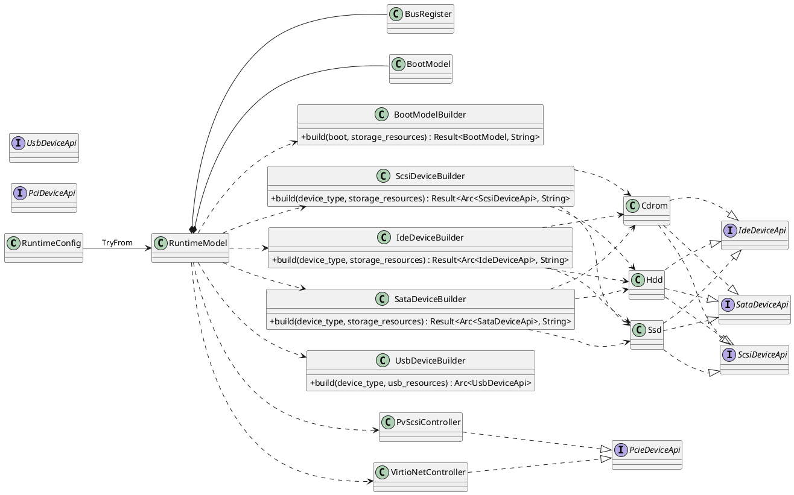
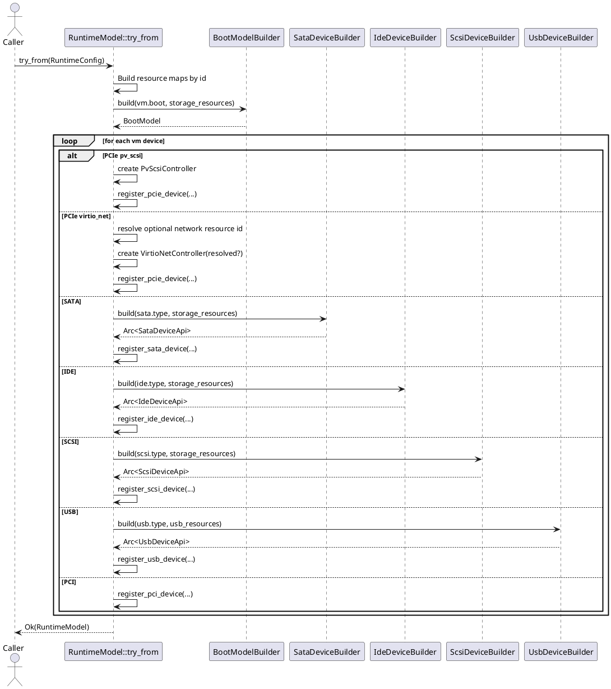
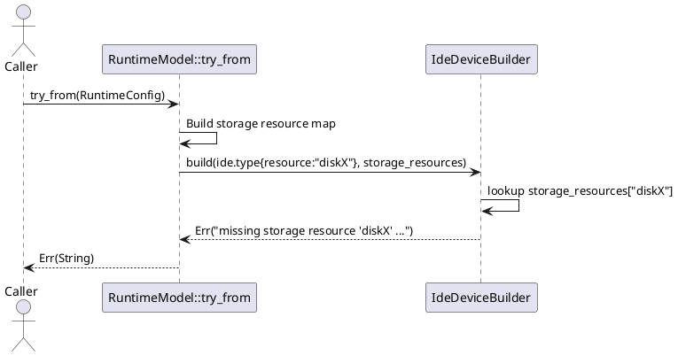

# Runtime model

## Requirements

- Represent a runnable, bus-oriented VM model derived from canonical runtime config.
- Keep conversion deterministic: the same runtime config must produce the same runtime topology.
- Resolve resource references (`storage`, `network`, `usb_device`) during model construction.
- Fail fast with actionable errors when required referenced resources are missing.
- Keep bus/device registration explicit per bus family (PCIe, PCI, USB, SATA, IDE, SCSI).

## Design

`RuntimeModel` is built from `RuntimeConfig` via `TryFrom<RuntimeConfig>` in [src/runtime_model/model.rs](src/runtime_model/model.rs).

High-level flow:

1. Collect top-level resources into lookup maps keyed by `id`.
2. Instantiate chipset and register foundational buses.
3. Build `BootModel` using `BootModelBuilder`.
4. Build optional top-level runtime feature models (`Gpu`, `Display`, `Audio`, `GuestAgent`, `TPM`).
5. Iterate `virtual_machine.devices` and register each device on its target bus.
6. For resource-backed devices, resolve `resource` ids through builder helpers.

### Builder-based resource resolution

Runtime model uses dedicated builders to keep device/resource binding logic localized:

- [src/runtime_model/boot.rs](src/runtime_model/boot.rs): `BootModelBuilder`
- [src/runtime_model/display.rs](src/runtime_model/display.rs): `DisplayModelBuilder`
- [src/runtime_model/gpu.rs](src/runtime_model/gpu.rs): `GpuModelBuilder`
- [src/runtime_model/audio.rs](src/runtime_model/audio.rs): `AudioModelBuilder`
- [src/runtime_model/guest_agent.rs](src/runtime_model/guest_agent.rs): `GuestAgentModelBuilder`
- [src/runtime_model/tpm.rs](src/runtime_model/tpm.rs): `TpmModelBuilder`
- [src/runtime_model/sata.rs](src/runtime_model/sata.rs): `SataDeviceBuilder`
- [src/runtime_model/ide.rs](src/runtime_model/ide.rs): `IdeDeviceBuilder`
- [src/runtime_model/scsi.rs](src/runtime_model/scsi.rs): `ScsiDeviceBuilder`
- [src/runtime_model/usb.rs](src/runtime_model/usb.rs): `UsbDeviceBuilder`

Each builder accepts the parsed device/boot payload plus the relevant resource map and returns either:

- a concrete runtime model object (`BootModel`), or
- a bus device API object (`Arc<dyn ...DeviceApi>`), optionally wrapped in `Result` when resolution can fail.

### Resource binding behavior

- SATA/IDE/SCSI device variants carry storage resource ids and are resolved against storage resources.
- PCIe `virtio_net` optionally carries a network resource id and resolves against network resources.
- PCIe `virtio_net` additionally supports optional metadata for MAC address, queue sizing (`rx_queue_size`, `tx_queue_size`), and `vhost` offload preference.
- USB devices are constructed through `UsbDeviceBuilder`; usb resource map is already threaded through for feature growth.
- Boot model is built from boot config and storage resources.
- Gpu/display/audio/guest-agent are top-level optional runtime features; they are assembled independently from bus registration and contribute command-line arguments when present.

Missing referenced resources return descriptive errors during `RuntimeModel::try_from(...)` construction.

### Module boundaries

- [src/runtime_model/model.rs](src/runtime_model/model.rs): orchestration, bus registration, runtime assembly.
- [src/runtime_model/gpu.rs](src/runtime_model/gpu.rs): GPU model (`standard`, `qxl`, `virtio`, `headless`, `passthrough`).
- [src/runtime_model/display.rs](src/runtime_model/display.rs): display frontend model (`gtk`, `sdl`, `vnc`, `spice`, `looking_glass`).
- [src/runtime_model/audio.rs](src/runtime_model/audio.rs): audio backend and controller model.
- [src/runtime_model/guest_agent.rs](src/runtime_model/guest_agent.rs): guest agent channel model.
- [src/runtime_model/devices](src/runtime_model/devices): concrete device implementations (`Hdd`, `Ssd`, `Cdrom`, `VirtioNetController`, `PvScsiController`).
- Bus-family modules (`pcie.rs`, `pci.rs`, `usb.rs`, `sata.rs`, `ide.rs`, `scsi.rs`) define device/controller APIs, addresses, and builder logic.

### Class diagram: runtime assembly structure

### Sequence diagram: successful runtime model construction

Typical use case: storage-backed IDE/SATA/SCSI devices plus optional network-backed PCIe virtio-net.

### Sequence diagram: missing resource failure path

Typical failure: a storage-backed device references a non-existent storage resource id.

### Current implementation notes

- Lifecycle actions (`start`, `stop`, `reset`, `shutdown`) are scaffolded and currently log intent.
- `gpu`, `display`, `audio`, and `guest_agent` are represented as optional top-level runtime features.
- Runtime model is qemu-agnostic. QEMU command rendering is owned by `src/config_format/qemu_cmd/runtime_render.rs`.
- Validation of duplicate/missing resource references lives in runtime config validation, while runtime model conversion performs final lookup enforcement.
